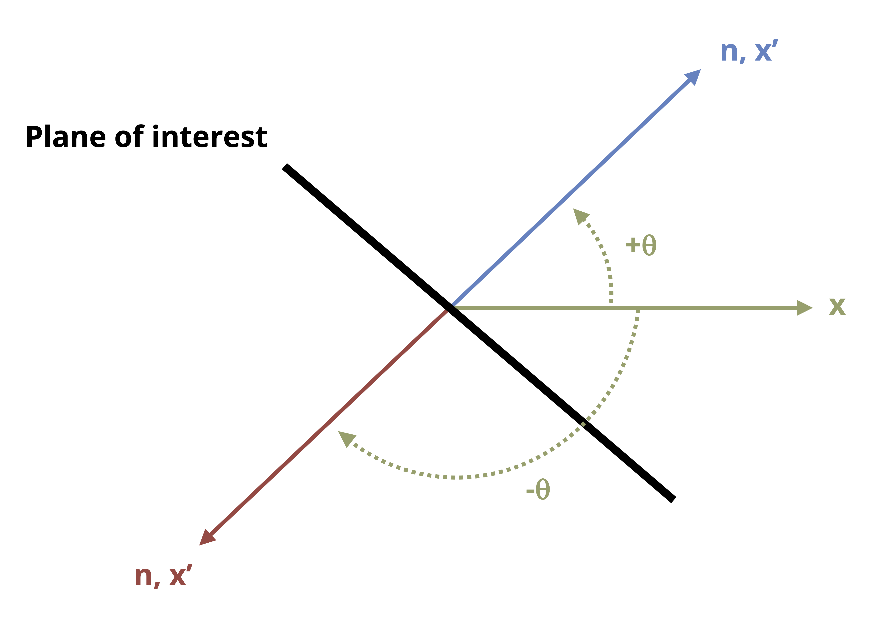

# Stress Transformation {#sec-stress-transformation}

::: {.callout-note icon="false"}
## Learning Objectives

-   Use shear and normal stress states calculated in a given plane to find the shear and normal stress state in a different (rotated) plane using equations and using Mohr’s circle
-   Use shear and normal stress states calculated in a given plane to find the planes of maximum and minimum stresses, as well as the corresponding stress magnitudes, by using both equations and Mohr’s circle
-   Calculate the absolute maximum shear stress using both equations and Mohr’s circle
:::

The preceding chapters discussed how to calculate normal and shear stresses that arise from various loading situations. Also discussed was how those stresses can vary from point to point on a body or structure. The combination of normal stress and shear stress that exists at a point is referred to as the general stress state. When we restrict analysis to 2D states of stress, we can represent the stress state on a 2D stress element as discussed in @sec-4.7 and illustrated in @fig-4.9 for the x-y plane.

The plane of the stress state depends on the coordinate system chosen for calculating the stresses. The coordinate system most often chosen is one considered to be the most straightforward system for the given loading directions and geometrical orientation of the body. However, the plane for which the stresses are most easily calculated is not always the only plane for which we would want to know the stress state.

For example, @fig-12.1 shows an air duct that is part of a heat pump system and is subject to internal air pressure. The welded seams are wound in a helical pattern that forms an angle with the horizontal (x) axis. @sec-thin-walled-pressure-vessels develops basic equations to calculate stress in the x-y plane due to pressure. However, in this case it's additionally important to know the stresses in the directions parallel and perpendicular to the weld seams (x'-y' plane) to ensure that the weld could tolerate the loading, so being able to transform the stresses we can most easily calculate in x and y directions to the x' and y' directions would be useful.

{#fig-12.1 fig-alt="Cylindrical metal duct with two right-angle coordinate systems. The first coordinate system has a vertical arrow labeled y (longitudinal) and a horizontal arrow pointing to the right labeled x (hoop). These indicate the directions of stress on the cylindrical surface: longitudinal stress acts along the cylinder’s length, and hoop stress acts around its circumference. A second coordinate system is shown, where the horizontal axis x′ lies along the weld seam and the vertical axis y′ is perpendicular to it." fig-align="center" width="268"}

This chapter begins by detailing how to represent a 2D stress state on a stress element (@sec-12.1).

Then it addresses how to derive stress transformation equations that allow us to use a given stress state in one plane to find the corresponding stress state in different planes (@sec-12.2). This process is known as stress transformation.

Also addressed is how to derive equations that allow us to determine the planes on which the maximum and minimum normal and shear stresses occur and the corresponding stress states (@sec-12.3). The maximum and minimum normal stresses are considered principal stresses.

@sec-12.4 discusses an alternative graphical method for performing stress transformation, known as Mohr’s circle.

@sec-12.5 prompts us to use Mohr’s circle to expand our analysis and look not only at the shear stress in the original 2D plane but also out-of-plane shear stress.

## Stress Elements for 2D Stress States {#sec-12.1}

Click to expand

A square stress element shows the normal stress and shear stress at a point for a 2D stress state (see @fig-12.4). Here we discuss the important aspects of the stress element:

1\. Plane of the element

The coordinate axes on the stress element represent the plane on the body where the point is located, with the positive directions indicated by arrows and axes labels. To determine the plane a point is on, we observe the axes on a square element on the side of the body when viewing it straight on. @fig-12.2 illustrates three points on a body, each on a different plane (x-y, y-z, and x-z).

{#fig-12.2 fig-alt="3D rectangular prism with a small square element on each of its three orthogonal faces. On the top face (xz plane), the square has an arrow labeled x pointing right from its right edge and an arrow labeled z pointing downward from its bottom edge. On the front face (xy plane), the square has an arrow labeled x pointing right from its right edge and an arrow labeled y pointing upward from its top edge. On the side face (yz plane), the square has an arrow labeled y pointing upward from its top edge and an arrow labeled z pointing outward to the left from its left edge. A 3D right-handed Cartesian coordinate system is shown to the left, where y points upward, x points to the right, and z is perpendicular to both, pointing diagonally toward the viewer." fig-align="center" width="206"}

2\. Positive and negative faces

We refer to the edges of the element as positive faces and negative faces depending on which way the coordinate axes are oriented. For example, if the vertical coordinate axis is positive upward, then the top edge of the element is the positive face for that coordinate axis and the bottom edge is the negative face. This is illustrated for two different planes in @fig-12.3.

3\. Normal stresses

Normal stresses that are positive (tensile) are illustrated by arrows that point away from the element. Negative normal stresses (compressive) point toward the element. Normal stresses directed in the horizontal direction are shown on the left and right faces of the element, and normal stresses directed in the vertical direction are shown on the top and bottom faces.

4\. Shear stress

As explained in @sec-4.7, the shear stress will be the same on all sides of the stress element. The manner in which the shear stress arrows are oriented around the body indicates the sign. A positive shear stress is one for which the shear stress arrow points in a positive direction on a positive face or in a negative direction on a negative face. The arrows are drawn such that no matter which face you choose to examine, you should reach the same conclusion. The magnitude of the shear stress is usually specified in one corner of the element.

For example, @fig-12.3 shows that for the positive shear stress case, the shear stress arrow on the +x-face points in the +y direction and the shear stress arrow on the -x-face points in the -y direction. Either way a positive shear stress is indicated and would yield the same result as for the y-faces.

For the negative shear stress case, the shear stress arrow on the +x-face points in the -z direction and the shear stress arrow on the -x-face points in the +z direction. Either way a negative shear stress is indicated and would yield the same result as for the z-faces.

{#fig-12.3 fig-alt="Two square stress element diagrams are shown side by side to demonstrate positive and negative shear stress. In the left diagram, the x axis is horizontal, and the y axis is vertical. This diagram shows positive shear stress: on the top edge (+y face) the shear acts to the right, on the bottom edge (-y face) it acts to the left, on the left edge (-x face) it acts downward, and on the right edge (+x face) it acts upward. The right diagram shows a stress element on the xz plane, where the x axis is horizontal to the right and the z axis is vertical. In this case, on the top edge (-z face) the shear acts to the right, on the bottom edge (+z face) it acts to the left, on the left edge (-x face) it acts downward, and on the right edge (+x face) it acts upward." fig-align="center" width="472"}

An example of a fully drawn stress element can be found in @fig-12.4. In this case the shear stress is 𝜏~xz~ = +16 MPa (note the positive z-directed shear stress arrow on the positive x-face), and the normal stresses are 𝜎~x~ = -150 MPa and 𝜎~z~ = +90 MPa.

{#fig-12.4 fig-alt="A square element is shown in the xz plane subjected to a combination of normal and shear stresses, represented by arrows. In the x direction (vertical), a compressive normal stress of 150 MPa is applied: a downward arrow is shown at the middle of the top edge, and an upward arrow at the middle of the bottom edge. In the z direction (horizontal), a tensile normal stress of 90 MPa is applied: a leftward arrow is shown at the middle of the left edge, and a rightward arrow at the middle of the right edge. Positive shear of 16 MPa acts on the element, with a leftward arrow on the top edge, a rightward arrow on the bottom edge, an upward arrow on the left edge, and a downward arrow on the right edge." fig-align="center" width="319"}

## Stress Transformation Equations {#sec-12.2}

Click to expand

The @sec-12.2.1 stress transformation equations allow us to use a set of stresses in one given plane (e.g., σ~x~, σ~y~, and τ~xy~) as inputs to determine stresses in any other plane of interest. Understanding the derivations will help lend clarity to the inputs and outputs of the equations. If you wish to skip the derivation, go directly to @eq-12.1 and/or @eq-12.2. @sec-12.2.2 covers the details of how to use the equations.

### Derivation of Equations {#sec-12.2.1}

Transformation of a uniaxial stress state was examined in @sec-2.4. In that case a known force acting in the axial direction enabled us to determine the stress on an inclined plane. The current derivation for a more general stress state is based on the same idea of cutting a section and applying equilibrium.

@fig-12.5 shows a stress element representing a general stress state in the x-y plane and the full body diagram (FBD)—but with stresses instead of forces—of the element cut along the plane of interest. The n and t directions are normal and parallel to the incline respectively, and 𝜃 and 𝛽 are complementary angles.

{#fig-12.5 fig-alt="Three figures arranged horizontally, showing a stress element in the xy plane and the free body diagram of a cut along an inclined plane. Figure A (left): A square stress element is subjected to normal stresses sigma sub x (horizontal) and sigma sub y (vertical), both in tension. Arrows on the right and left edges point outward to the right and left, respectively, indicating sigma sub x. Arrows on the top and bottom edges point upward and downward, respectively, indicating sigma sub y. Positive shear stress tau sub xy is shown on all sides: on the top edge it acts to the right, on the bottom edge to the left, on the left edge downward, and on the right edge upward. A diagonal cut oriented northwest divides the element into two trapezoids, forming an angle beta with the horizontal. Figure B (middle): The free body diagram of the cut section is shown as a triangular element. Normal stress sigma sub x acts outward to the left on the vertical face, and sigma sub y acts downward on the base. Shear stresses tau sub xy act inward: downward along the vertical face and leftward along the base. The normal stress component sigma sub n acts outward, perpendicular to the inclined face, and the shear stress tau sub n t acts along the incline in the northwest direction. An angle theta is defined between the inclined face and the horizontal, and a unit normal vector n points northeast, perpendicular to the surface. Figure C (right): A triangular prism represents the surface areas of the cut section. The vertical face is labeled dA sub x (blue), the horizontal base is labeled dA sub y (green), and the inclined face is labeled dA prime (red). Angle beta is shown between dA sub y and dA prime, and an inset defines angle theta between the inclined surface and the horizontal, with a unit normal vector n perpendicular to dA prime." fig-align="center"}

We can proceed as follows:

1\. Write expressions for the forces that correspond to the stresses acting on the cut element. Do this by multiplying the stresses with the area of the side of the element they act on. These areas are illustrated in @fig-12.5 (C). Note that σ~y~ and the τ~xy~ on the bottom face of the element act on area dA~y~, while σ~x~ and the τ~xy~ on the left face of the element act on area dA~x~. The internal forces normal and parallel to the incline act on area dA'.

On the left face we have

$$ F_x=-\sigma_x\ dA_x\\ F_y=-\tau_{xy}\ dA_x\\ $$

On the bottom face we have

$$ F_y=-\sigma_y\ dA_y\\ F_x=-\tau_{xy}\ dA_y\\ $$

Both faces exhibit negative signs because the stresses act to the left (negative x) and down (negative y).

On the inclined face we have

$$ \begin{aligned} &F_x=\sigma_n\ dA'\ cos(\theta)-\tau_{nt}\ dA' sin(\theta)\\ &F_y=\sigma_n\ dA'\ sin(\theta)+\tau_{nt}\ dA' cos(\theta)\\ \end{aligned} $$

2\. Express dA~x~ and dA~y~ in terms of dA'.

Using trigonometry results in

$$ \begin{aligned} dA_x & =dA'\sin(\beta)\\ &=d A^{\prime} \cos (\theta)\\ \end{aligned} $$

$$ \begin{aligned}dA_y & =dA'\cos(\beta)\\&=d A^{\prime} \sin (\theta)\\\end{aligned} $$

3\. Substitute these area expressions into the force equations and write the force equilibrium equations.

$$ \begin{gathered}\sum F_x=-\sigma_x\ d A^{\prime} \cos (\theta)-\tau_{xy}\ d A^{\prime} \sin (\theta)+\sigma_n\ dA' cos(\theta) -\tau_{n t}\ d A^{\prime} \sin (\theta)=0 \\[10pt]\sum F_y=-\tau_{xy}\ d A^{\prime} \cos (\theta)-\sigma_y\ d A^{\prime} \sin (\theta) +\sigma_n\ dA' sin(\theta)+\tau_{n t}\ dA'\ cos(\theta)=0\end{gathered} $$

4\. Solve the equilibrium equations for σ~n~ and τ~nt~ and simplify.

$$
\boxed{\begin{aligned}
& \sigma_n=\sigma_x \cos ^2(\theta)+\sigma_y \sin ^2(\theta)+2 \tau_{x y} \sin (\theta) \cos (\theta) \\[10pt]
& \tau_{n t}=-\left(\sigma_x-\sigma_y\right) \cos (\theta) \sin (\theta)+\tau_{x y}\left(\cos ^2(\theta)-\sin ^2(\theta)\right)
\end{aligned}}
$$ {#eq-12.1}

These equations are the stress transformation equations.

Alternatively, implementing the trigonometric identities results in

$$
\begin{gathered}
\cos ^2(\theta)=\frac{1+\cos (2 \theta)}{2} \\
\sin ^2(\theta)=\frac{1-\cos (2 \theta)}{2} \\
\sin (2 \theta)=2 \sin (\theta) \cos (\theta) \\
\cos (2 \theta)=\cos ^2(\theta)-\sin ^2(\theta)
\end{gathered}
$$

The transformation equations can also be expressed as

$$
\boxed{\begin{aligned}
\sigma_n & =\frac{\sigma_x+\sigma_y}{2}+\frac{\sigma_x-\sigma_y}{2} \cos (2 \theta)+\tau_{x y} \sin (2 \theta) \\[10pt]
\tau_{n t} & =-\frac{\sigma_x-\sigma_y}{2} \sin (2 \theta)+\tau_{x y} \cos (2 \theta)
\end{aligned}}\text{ ,}
$$ {#eq-12.2}

| where
| *𝜎~n~ = Average normal stress perpendicular to the inclined plane \[Pa, psi\]*
| *𝜏~nt~ = Average shear stress parallel to the inclined plane \[Pa, psi\]*
| *𝜎~x~ = Average normal stress in the x direction before any transformation \[Pa, psi\]*
| *𝜎~y~ = Average normal stress in the y direction before any transformation \[Pa, psi\]*
| *𝜏~xy~ = Average shear stress in the x-y plane before any transformation \[Pa, psi\]*
| *𝜃 = Angle between x-axis and n-axis \[*$^\circ$*, rad\]*

Either @eq-12.1 or @eq-12.2 will work to perform stress transformations. Which set to use is determined by personal preference.

### Using the Stress Transformation Equations {#sec-12.2.2}

Whereas the n and t directions have referred to the directions normal and parallel to an incline, a planar element will have two normal directions, as represented by x,y and x', y' in @fig-12.6. In transforming stresses from the x-y plane to the x'-y' plane, we can distinguish between the two normal stresses by the angle used in the stress transformation equation for 𝜎~n~. Given how 𝛳 was defined in the derivation of the transformation equations, the following is true:

$$ \sigma_{x'}=\sigma_n(\theta)\\ \sigma_{y'}=\sigma_n(\theta+90^\circ)\\ \tau_{x' y'}=\tau_{nt}(\theta) $$

{#fig-12.6 fig-alt="Two figures showing a coordinate transformation applied to a square element. On the left, the square is aligned with the original xy Cartesian coordinate system, with the x axis pointing to the right and the y axis pointing upward. On the right, the same square is rotated counterclockwise by an angle theta, introducing a new coordinate system labeled x prime and y prime. The x prime axis is inclined by an angle theta relative to the original x axis, and the y prime axis is oriented 90 degrees plus theta from the original x axis." fig-align="center" width="437"}

Another way to quickly determine σ~y'~ once σ~x’~ is known is to apply the concept of stress invariance[,]{.underline} where the sum of the normal stresses remains constant across different planes.

$$ (\sigma_x\ +\sigma_y)=constant $$

or

$$ \boxed{(\sigma_{x'}\ +\sigma_{y'})=(\sigma_x\ +\sigma_y)} $$ {#eq-12.3}

It is imperative to understand which angle to substitute into the given transformation equations, including whether the angle is positive or negative. To ensure the correct angle and sign are used, refer to @fig-12.7 and take the following steps:

1.  Draw a line that represents one side of the plane of interest.

2.  Draw the x-axis (positive to the right).

3.  Draw the axis normal to the plane of interest. Whether you draw the normal axis oriented counterclockwise or clockwise from the x-axis doesn't matter as long as you use the correct magnitude and sign for the corresponding θ (see step 4).

4.  Determine the angle that leads from the x-axis to the normal axis. This angle is θ. If the direction from the x-axis to the normal axis is counterclockwise, then θ is positive. If the direction from the x-axis to the normal axis is clockwise, then θ is negative.

{#fig-12.7 fig-alt="Orientation of a plane of interest, represented by a thick black diagonal line running northeast and intersecting the origin. The x axis is drawn horizontally to the right. A vector labeled n, x prime is shown rotated counterclockwise by a positive angle theta (blue arrow pointing northeast) and clockwise by a negative angle theta (red arrow pointing southwest) relative to the original x axis." fig-align="center" width="394"}

### Equation Inputs for Planes Other than x-y {#sec-12.2.3}

In some cases the reference stress state may not be in the x-y plane, or the x-axis and y-axis may be oriented differently from the orientation in @fig-12.5. In these cases adjustments are required to implement the transformation equations to ensure consistency of inputs with how the equations were derived.

As an example, consider the reference stress state in @fig-12.8. As given, you might question which stress to substitute for 𝜎~x~ and which to substitute for 𝜎~y~. Keeping in mind that the transformation equations were derived from a coordinate system in which the horizontal axis is positive to the right and the vertical axis is positive upward, we can ensure consistency with the inputs by reorienting the reference stress element in the same way, as is also shown in @fig-12.8. We can then attribute the coordinate designated to the horizontal direction to correspond to the x terms in the transformation equations, and likewise the coordinate designated to the vertical direction to correspond to the y terms in the transformation equations. In the case of the stress state in @fig-12.8, we would substitute -150 MPa for 𝜎~x~, 90 MPa for 𝜎~y~, and 16 MPa for τ~xy~.

{#fig-12.8 fig-alt="Two figures showing a reference stress element and a reoriented stress element. The reference element on the left is a square element in the xz plane subjected to a combination of normal and shear stresses, represented by arrows. In the x direction (vertical), a compressive normal stress of 150 MPa is applied: a downward arrow is shown at the middle of the top edge, and an upward arrow at the middle of the bottom edge. In the z direction (horizontal), a tensile normal stress of 90 MPa is applied: a leftward arrow is shown at the middle of the left edge, and a rightward arrow at the middle of the right edge. Positive shear stress of 16 MPa acts on the element, with a leftward arrow on the top edge, a rightward arrow on the bottom edge, an upward arrow on the left edge, and a downward arrow on the right edge. On the right, the reoriented stress element is shown. A tensile normal stress of 90 MPa now acts in the z direction, with an upward arrow on the top edge and a downward arrow on the bottom edge. A compressive stress of 150 MPa acts in the x direction, with a rightward arrow on the left edge and a leftward arrow on the right edge. Negative shear stress of 16 MPa acts on the reoriented element, with a rightward arrow on the top edge, a leftward arrow on the bottom edge, a downward arrow on the left edge, and an upward arrow on the right edge." fig-align="center"}

@exm-12.1 and @exm-12.2 illustrate the use of the stress transformation equations.

::::: {.callout-tip collapse="true" icon="false"}
## Example 12.1

:::: {#exm-12.1}

The general stress state at a point on a hollow pipe formed with spiral welds inclined to an angle β with respect to the horizontal is shown.

For β = 42° and stress magnitudes S~x~ = 128 MPa, S~y~ = 80 MPa, and S~xy~ = 75.45 MPa, determine the stress parallel and perpendicular to the weld.

{fig-alt="Two figures with the stress element on the left and a vertical cylindrical pipe with welds on the right. The reference element on the left is a square element on the xy plane subjected to a combination of normal and shear stresses, represented by arrows. In the x direction (horizontal), a tensile stress of S sub x acting leftward on the left edge and rightward on the right edge both acting on the middle of the edges. In the y direction (vertical), a tensile of S sub y is applied an upward arrow is shown at the middle of the top edge, and a downward arrow at the middle of the bottom edge. A shear stress of S sub xy acts on the element where the arrow acts leftward and rightward on the top and bottom edge and upward and downward on the the left and right edge. The right image is of a cylindrical object with multiple helical or coil-like curves wrapped around its surface. These curves are inclined relative to the horizontal axis, and the angle of inclination is labeled as beta. The x direction is to the right at the bottom of the base and the y axis is perpendicular to the base." fig-align="center" width="630"}

::: {.callout-tip collapse="true" icon="false"}
## Solution

The stress parallel and perpendicular to the weld can be found by applying the stress transformation equations with σ~x~ = 128 MPa, σ~y~ = 80 MPa, and τ~xy~ = -75.45 MPa.

$$
\begin{aligned}
& \sigma_n=\sigma_x \cos ^2(\theta)+\sigma_y \sin ^2(\theta)+2 \tau_{x y} \sin (\theta) \cos (\theta) \\
& \tau_{n t}=-\left(\sigma_x-\sigma_y\right) \cos (\theta) \sin (\theta)+\tau_{x y}\left(\cos ^2(\theta)-\sin ^2(\theta)\right)
\end{aligned}
$$

Note that the normal stresses are positive since they are both shown to be tensile on the given stress element but that the shear stress is negative because the shear stress arrow points in the negative y direction on the positive x-face. (The same conclusion can be drawn by observing any of the other faces.)

To find the angle θ to substitute into the equations, follow the process described in @sec-12.2.2:

1.  Draw the line that represents the plane of interest. In this case the plane of interest is the plane of the weld that is parallel to the spiral.
2.  Draw the x-axis leading positive to the right.
3.  Draw the axis normal (n) to the plane of interest.
4.  Determine the angle that leads from the x-axis to the normal axis. This angle is θ.
    -   If we use the angle from the x-axis to the solid normal axis, the angle will be negative since that is a clockwise rotation: θ = -(90 – β) = -48°.
    -   We could also base θ on the dashed normal axis, in which case the magnitude of θ would be θ = 180° – 48° = 132°. This angle is positive since the rotation from the x-axis to the dashed normal axis is counterclockwise.

{fig-alt="A coordinate diagram shows a weld line inclined to the horizontal x axis. From the origin, a bold line labeled “Weld” runs diagonally upward to the right, while a vector labeled n points diagonally downward to the right, perpendicular to the weld. A dashed arrow points diagonally upward to the left, also perpendicular to the weld. The angle between the x axis and the weld line is labeled beta (β). The angle theta (θ) is measured counterclockwise from the x axis to the dashed arrow and clockwise from the x axis to the vector n. The weld line makes an angle of beta with the horizontal." fig-align="center" width="267"}

Calculate.

$$
\begin{aligned}
& \sigma_n=(128{~MPa}) \cos ^2(-48^\circ)+(80{~MPa}) \sin ^2(-48^\circ)+2\ (-75.45{~MPa}) \sin (-48^\circ) \cos (-48^\circ) \\
&\sigma_n = 176.5{~MPa} \\[10pt]
& \tau_{n t}=-\left(128{~MPa}-80{~MPa}\right) \cos (-48^\circ) \sin (-48^\circ)-(75.45{~MPa})\left(\cos ^2(-48^\circ)-\sin ^2(-48^\circ)\right) \\
&\tau_{n_t} = 31.76{~MPa}
\end{aligned}
$$

**Answer:**

With σ~x~ = 128 MPa, σ~y~ = 80 MPa, τ~xy~ = -75.45 MPa, and θ = -48° (or +132°), the stress normal to the weld is σ~n~ = 176.5 MPa. The stress parallel to the weld is τ~nt~ = 31.76 MPa.
:::
::::
:::::

::::: {.callout-tip collapse="true" icon="false"}
## Example 12.2

:::: {#exm-12.2}

Stresses at a point on a body are calculated and represented on the stress element given below. Normal and shear stress magnitudes acting on horizontal and vertical planes at the point are S~x~ = 1,700 psi, S~y~ = 800 psi, and S~xy~ = 790 psi.

Determine the normal and shear stresses at this point for the plane rotated β = 36° from the horizontal axis as shown. Represent the stress state for the rotated plane on a stress element.

{fig-alt="A square stress element is subjected to normal stresses: S sub x (horizontal) is compressive, and S sub y (vertical) is tensile. The x direction is horizontal, and the y direction is vertical. Arrows on the left and right edges point outward to the right and left, respectively, indicating S sub x. Arrows on the top and bottom edges point upward and downward, respectively, indicating S sub y. Shear stress S sub xy is shown on all sides: on the top edge it acts to the right, on the bottom edge to the left, on the left edge downward, and on the right edge upward. A diagonal cut oriented northwest divides the element into two trapezoids, forming an angle beta with the horizontal." fig-align="center" width="310"}

::: {.callout-tip collapse="true" icon="false"}
## Solution

First determine the angle θ needed for the stress transformation equations. Recall the process described in @sec-12.2.2:

1.  Draw a line that represents the plane of interest.

2.  Draw the x-axis positive going toward the right.

3.  Draw the axis normal (n) to the plane of interest.

4.  Determine the angle leading from the x-axis to the normal axis. This angle is θ.

    -   Either angle labeled θ in the illustration will work and produce the same results.

    -   The angle rotated counterclockwise from the x-axis is θ = 90 – β = 54°.

    -   The angel rotated clockwise from the x-axis is θ = -(90 + β) = -126°.

{fig-alt="A coordinate diagram shows a horizontal axis labeled x and an inclined axis labeled n (or x prime) extending upward to the right from the origin. A dashed diagonal arrow extends downward to the left, perpendicular to the n axis. The angle between the x axis and the n axis is labeled theta (θ), while the clockwise angle between the x axis and the dashed line is labeled negative theta (−θ). The same angle θ is shown again between the dashed line and the x axis but in the opposite direction. The n (or x prime) axis is perpendicular to a thick diagonal line running northwest. This thick line makes an angle beta (β) with the horizontal." fig-align="center" width="317"}

With θ determined, the only thing left to do is to make the substitutions into the stress transformation equations and calculate. Note that the σ~n~ equation will give us the normal stress on the rotated x-face (σ~x’~). We will also need to calculate σ~n~ with the angle (θ + 90°) to get σ~y’~ or use the stress invariance concept: (σ~x~ + σ~y~ = σ~x’~ + σ~y’~).

Substituting σ~x~ = -1,700 psi (negative since it is shown to be compressive), σ~y~ = 800 psi, τ~xy~ = 790 psi, and θ = 54° into the stress transformation equations

$$
\begin{aligned}
\sigma_n&=\frac{\sigma_x+\sigma_y}{2}+\frac{\sigma_x-\sigma_y}{2} \cos (2 \theta)+\tau_{x y} \sin (2 \theta) \\[10pt]
& =\frac{-1,700{~psi}+800{~psi}}{2}+\frac{-1,700{~psi}-800{~psi}}{2} \cos(2*54^\circ)+790{~psi}* \sin(2*54^\circ) \\[10pt]
& = 687.6{~psi} \\[10pt]\end{aligned}\\
$$ $$
\begin{aligned}
\tau_{n t}&=-\frac{\sigma_x-\sigma_y}{2} \sin (2 \theta)+\tau_{x y} \cos (2 \theta) \\[10pt]
&=-\frac{-1,700{~psi}-800{~psi}}{2} \sin (2*54^\circ)+790{~psi}*\cos (2*54^\circ) \\[10pt]
&=944.7psi\\
\end{aligned}
$$

yields σ~x’~ = 687.6 psi and τ~x’y’~ = 945 psi.

Applying stress invariance -1,700 psi + 800 psi = 687.6 psi + σ~y’~ yields σ~y'~ = -1,588 psi.

**Answer:**

σ~x’~ = 687.6 psi

τ~x’y’~ = 945 psi

σ~y'~ = -1,588 psi

Stress element for rotated plane:

The 687.5 psi stress goes on the face rotated 54° from the horizontal because this was the value obtained by substituting that angle into the stress transformation equation. It was determined to be tensile (positive) so it points away from the x' face.

The 1,588 psi stress is compressive (negative), so it points toward the y' face.

The shear stress transformation equation yielded a positive result, indicating a positive shear stress so the arrows are arranged on the stress element accordingly.

{fig-alt="Rotated stress element, with the original horizontal x axis indicated by a grey dashed line. The element is now oriented along the x prime and y prime axes. The x prime axis is rotated 54 degrees counterclockwise from the original x axis, and the y prime axis is perpendicular to it. The stress element is subjected to compressive normal stresses acting along both rotated axes. A compressive stress of 687.6 psi acts along the x prime axis, shown with arrows directed toward each other along that direction. A compressive stress of 1588 psi acts along the y prime axis, indicated by arrows directed toward each other along that axis. The element is also subjected to a shear stress of 945 psi. On the edges parallel to the x prime axis, the shear arrows act rightward and leftward, while on the edges parallel to the y prime axis, they act downward and upward." fig-align="center" width="368"}
:::
::::
:::::

::: {.callout-warning icon="false"}
## Step-by-Step: Stress Transformation

Given a general stress state (σ~x~, σ~y~, and τ~xy~) at a point in the x-y plane\* where x is the horizontal axis positive to the right and y is the vertical axis positive upward:

1.  Establish the angle θ that corresponds to the angle of rotation between the positive x-axis and the axis normal (x’) to the plane of interest. Remember to make the angle negative if the rotation is clockwise from the x-axis to the normal axis and positive if the rotation is counterclockwise.

2.  Substitute the stresses and the angle θ with the appropriate signs into the stress transformation equations to find σ~n~ and τ~nt~. Recall that normal stresses are negative if compressive and positive if tensile and that shear stresses are positive if the shear stress arrow on the positive x-face points in the positive y direction and negative otherwise. This will result in σ~x’~ and τ~x’y’~.

3.  Use (θ + 90°) in the σ~n~ transformation equation or apply the concept of stress invariance (σ~x~ + σ~y~ = σ~x’~ + σ~y’~) to find σ~y’~.

\*If the general stress state is given in some other plane, reorient (rotate) the stress element so that one of the axes is positive to the right (this axis will correspond to the x-axis in the equations) and the other axis is positive upwards (this axis will correspond to the y-axis in the equations).
:::

## Principal Stresses and Max/Min Shear Stress {#sec-12.3}

Click to expand

Often the plane we are the most concerned with is the one where the normal stress or the shear stress is at a maximum because it is where failure is most likely to occur. The maximum and minimum normal stresses are referred to as the principal stresses (σ~1~ and σ~2~), and the planes on which they act are the principal planes. The principal planes are described by angles of rotation,θ~p1~ and θ~p2,~ from the reference plane for which the general stress state as obtained. The maximum and minimum shear stresses are simply referred to as the maximum and minimum shear stress respectively, and the planes on which they occur are referred to simply as the planes of maximum and minimum shear stress (denoted as angles θ~s1~ and θ~s2~).

Important to note here is that only rotations within a two-dimensional plane are considered in this section. As discussed in @sec-12.5, the principal planes and principal stresses are the same even when we consider out-of-plane rotation of the stress element (see @fig-12.9), but the maximum shear stress could be different. Therefore the maximum and minimum shear stress as determined by the derived equations below will be referred to as the max/min in-plane shear stress.

{#fig-12.9 fig-alt="Two square elements, each with horizontal x and vertical y axes. On the left, the element is labeled “In-plane rotation,” with a curved dotted arrow with arrowheads on both ends arcing from the x axis toward the y axis within the plane of the square. On the right, the element is labeled “Out-of-plane rotation,” with a curved dotted arrow with arrowheads on both ends curving toward the x axis, indicating rotation occurring out of the plane of the square." fig-align="center" width="935"}

As we rotate the stress element, the normal stress changes in a manner predictable with the stress transformation equations. @fig-12.10 shows the variation of normal stress σ~x’~ with angle θ. A similar graph could be drawn for τ~x’y’~. Based on the equations and the plots, we know that the max and min stresses will occur at angles 90° apart from one another.

{#fig-12.10 fig-alt="Graph with a vertical axis labeled sigma sub x prime and a horizontal axis labeled theta (θ). A smooth blue sinusoidal curve shows the variation of sigma sub x prime with respect to theta. The curve starts from a value intersecting the sigma sub x prime axis, rises to a maximum labeled sigma sub 1, then decreases to a minimum labeled sigma sub 2, and increases again afterward. The distance between sigma sub 1 and sigma sub 2 along the theta axis is marked as 90 degrees." fig-align="center" width="354"}

From calculus we know that the maximums and minimums of a function that result from varying a single variable can be found by setting the derivative of the function with respect to that variable equal to 0 and then solving the resulting equation for the variable in question. Plugging the variable back into the original equation gives the corresponding maximum or minimum value of the function. This is also equivalent to finding where the slope of the function is equal to 0. Thus, to find the angles for which the normal stress and in-plane shear stresses are at extremes, we can simply set the derivatives of the transformation equations (@eq-12.1 or @eq-12.2) with respect to θ equal to 0, and solve for the θ values.

Using @eq-12.2 (though @eq-12.1 would yield the same results)

$$
\begin{aligned}
& \frac{d \sigma_n}{d \theta}=-\left(\sigma_x-\sigma_y\right) \sin \left(2 \theta_p\right)+2 \tau_{x y} \cos \left(2 \theta_p\right)=0 \\[10pt]
& \frac{d \tau_{n t}}{d \theta}=-\left(\sigma_x-\sigma_y\right) \cos \left(2 \theta_s\right)-2 \tau_{x y} \sin \left(2 \theta_s\right)=0
\end{aligned}
$$

Note that θ is subscripted with a p in the first equation because this angle represents a principal plane as defined. Similarly, θ is subscripted with an S in the second equation because this angle represents a plane of maximum (max) or minimum (min) in-plane shear stress.

These equations can be rearranged to isolate tan(2θ) on one side and subsequently used to find θ~p~ and θ~s~ values.

$$
\boxed{\begin{aligned}
\tan \left(2 \theta_p\right) & =\frac{2 \tau_{x y}}{\left(\sigma_x-\sigma_y\right)} \\[10pt]
\tan \left(2 \theta_s\right) & =-\frac{\left(\sigma_x-\sigma_y\right)}{2 \tau_{x y}}
\end{aligned}}\text{ ,}
$$ {#eq-12.4}

| where
| *𝜃~p~ = Orientation a principal plane with respect to the x-axis \[*$^\circ$*, rad\]*
| *𝜃~s~ = Orientation of the maximum or minimum in-plane shear plane with respect to the x-axis \[*$^\circ$*, rad\]*
| *𝜏~xy~ = Average shear stress in the x-y plane before any transformation \[Pa, psi\]*
| *𝜎~x~ = Average normal stress in the x direction before any transformation \[Pa, psi\]*
| *𝜎~y~ = Average normal stress in the y direction before any transformation \[Pa, psi\]*

Once the angles associated with the planes of extreme stresses are determined, they can be substituted into @eq-12.1 or @eq-12.2 along with the stresses in the given plane to find the principal stresses and max/min in-plane shear stress.

Here are a few calculation details that are helpful to remember:

1.  The inverse tangent function has two possible solutions. One solution is the angle that will be reported by a calculator, and the other possible answer is that angle plus or minus 180°. So if we take the inverse tangent of the expressions of @eq-12.4 and then divide that result by 2, we get one of the solution angles. Then adding or subtracting 90° to that angle gives the second. This applies for the θ~p~ and the θ~s~ values.

2.  By convention the most positive of the two principal stresses is denoted as σ~1~. The other principal stress is then σ~2~. The angle that produces that σ~1~ stress is θ~p1~, and the angle that produces σ~2~ is θ~p2~.

3.  The max/min in-plane shear stress will always turn out to be equal in magnitude but opposite in sign—in other words, the minimum shear stress is always the negative of the maximum shear stress. As with the principal planes and stresses, substitute one of the θ~s~ angles into the shear stress transformation equation to determine which angle corresponds to the maximum in-plane shear stress and which corresponds to the minimum.

4.  The angles of max/min shear stress are 90° apart from each other and 45° apart from the principal directions. For example, if one principal stress is found to be 40°, then the other principal direction can be determined as either 40° + 90° =130° or 40° - 90° = -50°. The angles of max/min in-plane shear stress can then be determined as either 40° + 45° = 95° or 40° -45° = - 5°. It is also acceptable to add or subtract 45° from 130° or from –50°.

5.  Given the variety of possible correct angles, here we use the convention that principal directions and angles of max/min shear stress are reported as the ones in the range –90° ≤ θ ≤ +90°.

If desired, the principal stresses and max/min shear stress can also be calculated directly without first finding the principal directions. The following equations arise from some equation manipulation which will not be detailed here, but can be used generally. Adding the term under the square root will give either the max or min stress and subtracting will give the other.

$$
\boxed{\begin{gathered}
\sigma_{1,2}=\frac{\sigma_x+\sigma_y}{2} \pm \sqrt{\left(\frac{\sigma_x-\sigma_y}{2}\right)^2+\tau_{x y}{ }^2} \\[10pt]
\tau_{x \prime y^{\prime}}= \pm \sqrt{\left(\frac{\sigma_x-\sigma_y}{2}\right)^2+\tau_{x y}{ }^2}
\end{gathered}}\text{ ,}
$$ {#eq-12.5}

| where
| *𝜎~1,2~ = Principal stresses \[Pa, psi\]*
| *𝜎~x~ = Average normal stress in the x direction before any transformation \[Pa, psi\]*
| *𝜎~y~ = Average normal stress in the y direction before any transformation \[Pa, psi\]*
| *𝜏~xy~ = Average shear stress in the x-y plane before any transformation \[Pa, psi\]*

Some useful conclusions that can be drawn simply by studying the principal plane and plane of max/min shear stress equations are as follows:

1.  Setting the shear stress transformation equation given in @eq-12.1 or @eq-12.2 equal to 0 results in the same equation for tan(2θ) as the tan(2θ~p~) equation in @eq-12.4. We can then conclude that *shear stress is 0 on the principal planes*. It can also be said that if the shear stress is found to be 0 on any given plane, then that plane must be a principal plane.

2.  The equation for tan(2θ~s~) is the negative inverse of the equation for tan(2θ~p~). This means that 2θ~s~ = 2θ~p~ ± 90° or θ~s~ = θ~p~ ± 45°. Recognizing this can enable us to calculate one set of angles more efficiently once the other is found.

3.  When either of the θ~s~ angles is substituted into the normal stress transformation equation, the normal stress will always work out to be the average stress $\left(\frac{\sigma_x+\sigma_y}{2}\right)$. Once again this recognition can help make determining the total stress state on the plane of in-plane max/min shear stress more efficient.

@exm-12.3 demonstrates the calculation of the principal stresses, the maximum in-plane shear stress, and the planes where these stresses occur.

::::: {.callout-tip collapse="true" icon="false"}
## Example 12.3

:::: {#exm-12.3}

The general stress state at a point in the x-y plane is represented by the stress element shown.

Determine the principal stresses and the maximum in-plane shear stress. Then draw the stress element rotated to one of the principal planes and the plane of max or min in-plane shear stress.

{fig-alt="A square stress element is shown with labeled normal and shear stresses acting on all four sides, where x is the horizontal axis and y is the vertical axis. The element is subjected to compressive normal stresses of 80 MPa in the x direction, directed inward on both the left and right faces. It is subjected to tensile normal stresses of 50 MPa in the y direction, directed outward on both the top and bottom faces. Shear stresses of 25 MPa are shown with a rightward arrow on the bottom face, a leftward arrow on the top face, an upward arrow on the left face, and a downward arrow on the right face." fig-align="center" width="346"}

::: {.callout-tip collapse="true" icon="false"}
## Solution

1\. Find the principal planes by substituting σ~x~ = -80 MPa, σ~y~ = 50 MPa, and τ~xy~ = -25 MPa into @eq-12.4.

$$
\begin{aligned}\tan (2\theta_p)&=\frac{2\tau_{xy}}{(\sigma_x-\sigma_y)}\\[10pt]
&=\frac{2\ (-25 MPa)}{(-80 MPa - 50 MPa)}\\[10pt]
&=0.3846\end{aligned}
$$

$$
2\theta_p=tan^{-1}(0.3846) = 21.038^\circ\\[10pt]
\theta_p=10.52^\circ
$$

So one of the principal angles is 𝜃~p~ = 10.52°.

The other angle is then θ~p~ = 10.52° + 90° = 100.52°.

Thus the principal plane angles are 10.52° and 100.52°.

2\. Substituting θ~p~ = 10.52° into @eq-12.2 yields

$$
\begin{aligned}
 \sigma_n&=\frac{\sigma_x+\sigma_y}{2}+\frac{\sigma_x-\sigma_y}{2} \cos (2 \theta)+\tau_{x y} \sin (2 \theta) \\[10 pt]
 &=\frac{-80{~MPa}+50{~MPa}}{2}+\frac{-80{~MPa}-50{~MPa}}{2}\cos(2*10.52^\circ)-25{~MPa}*\sin(2*10.52^\circ) \\[10pt]
& =-84.65{~MPa} \\\end{aligned}
$$

Substituting θ~p~ = 100.52° into the same equation yields

$$
\begin{aligned}& \sigma_{n}=\frac{-80{~MPa}+50{~MPa}}{2}+\frac{-80{~MPa}-50{~MPa}}{2}\cos(2*100.52^\circ)-25{~MPa}*\sin(2*100.52^\circ) \\[10pt]
& \sigma_{n}=54.65{~MPa}\end{aligned}
$$

Since 54.7 MPa is the more positive of the two principal stresses, σ~1~ = 54.7 MPa and σ~2~ = -84.7 MPa.

Given these results, we know that rotating the stress element counterclockwise by 10.52° results in σ~2~ = -84.7 MPa on the x'-face and σ~1~ = 54.7 MPa on the y'-face.\
\
Conversely, if the stress element is rotated counterclockwise by 100.52°, the stress on the x'-face would be 54.7 MPa and the stress on the y'-face would be -84.7 MPa.

The element rotated to the principal planes is shown below.

{fig-alt="Square stress element rotated 10.52 degrees counterclockwise. The element is subjected to a compressive stress of 84.7 MPa, shown with inward arrows along its rotated horizontal axis. It is subjected to a tensile stress of 54.7 MPa, shown with outward arrows along its rotated vertical axis. The angle between the original horizontal axis and the rotated vertical axis is 100.52 degrees measured counterclockwise." fig-align="center" width="404"}

Note that the stress element looks the same no matter which angle is used for the rotation. Recall the discussion at the end of @sec-12.3 that the shear stress on the principal plane is 0.

3\. Next find the planes of max/min in-plane shear planes as well as the corresponding shear stresses. Note that we could use\
$$
\tan (2\theta_s)=-\frac{(\sigma_x-\sigma_y)}{2 \tau_{x y}}
$$

but since we already have the θ~p~ angles, we can also more easily use

$$
\theta_S=\theta_p \pm 45^\circ
$$

Choose either θ~p~ angle to add and subtract the 45°. The final orientation of the element would be the same in either case. Since visualizing angle rotations smaller in magnitude than 90° is generally easier than working with larger magnitudes, use the smaller θ~p~ value.

\
So θ~s~ = 10.52° ± 45° = 55.5° and -34.5°.

4\. Substituting θ~s~ = 55.5° into\
$$
\tau_{n t}=-\frac{\sigma_x-\sigma_y}{2} \sin (2 \theta)+\tau_{x y} \cos (2 \theta)
$$

yields $$
\begin{aligned}
\tau_{nt}&=-\frac{-80{~MPa}-50{~MPa}}{2}\sin(2*55.5^\circ)-25{~MPa}\cos(2*55.5^\circ)\\[10pt]
&=69.6{~MPa}
\end{aligned}
$$

Since this is a positive value, this is the maximum in-plane shear stress and so θ~s~ = -34.5° should yield τ~nt~ = -69.6 MPa = τ~min~ (in-plane).

Rotating the stress element counterclockwise by 55.5°, will result in a positive shear stress, and rotating clockwise by 34.5° will result in a negative shear stress.

5\. The normal stress on the plane of max/min in-plane shear stress is\
$$
\begin{aligned}
\sigma&=\sigma_{avg}=\frac{\left(\sigma_x+\sigma_y\right)}{2}\\[10pt]
&=\frac{-80{~MPa}+50{~MPa}}{2}\\[10pt]
&=-15{~MPa}
\end{aligned}
$$

Draw the stress element rotated to the planes of max/min in-plane shear stress.

{fig-alt="Square stress element rotated to the planes of maximum and minimum in-plane shear stress. The element is rotated 55.5 degrees counterclockwise, with the rotated horizontal axis labeled x prime axis for theta sub s equal to 55.5 degrees. The element is under compression in both the horizontal and vertical directions, with normal stresses of 15 MPa acting inward. Tangential shear stresses of 69.6 MPa act along the surfaces, shown with arrows directed parallel to the faces and opposing each other on opposite sides of the element. Another x prime axis is shown for the case when the angle is negative 34.5 degrees (rotated 34.5 degrees clockwise), labeled as x prime axis for theta sub s equal to negative 34.5 degrees." fig-align="center" width="382"}

Once again notice that the stress element looks fundamentally the same whichever θ~s~ angle is used.

**Answer:**

θ~p1~ = 100.52° and θ~p2~ = 10.52°

σ~1~ = 54.7 MPa and σ~2~ = -84.7 MPa

θ~s~ = 55.5° and -34.5°

τ~max~ (in-plane) = 69.6 MPa

τ~min~ (in-plane) = -69.6 MPa

Elements are drawn above.
:::
::::
:::::

::: {.callout-warning icon="false"}
## Step-by-Step: Principal Stresses and Max/Min Shear Stress

Given a general stress state (σ~x~, σ~y~, and τ~xy~) at a point in the x-y plane where x is the horizontal axis positive to the right and y is the vertical axis positive upward, do the following:

1.  Use the tan(2θ~p~) equation to find the planes of principal stresses. One of the principal angles is found using the inverse tan function on the calculator. The other angle will be 90° from that one.

2.  Substitute the two θ~p~ angles into the σ~n~ transformation equation to determine the principal stresses. The most positive of the two is deemed σ~1~ and the other is σ~2~. Alternatively, substitute only one angle into the stress transformation to find one of the principal stresses. The other principal stress can be calculated using stress invariance.

3.  Use the tan(2θ~s~) equation to find the planes of max/min in-plane shear stress. Alternatively, add or subtract 45° from one of the principal plane angles.

4.  Substitute one of the θ~s~ angles into the τ~nt~ equation to determine whether it leads to the maximum in-plane shear stress or the minimum in-plane shear stress. The other angle will lead to a shear stress of equal magnitude but opposite sign.

5.  Calculate the average stress. This stress is the normal stress on the x’-face and y’-face when the stress element is rotated to the planes of max/min in-plane shear stress.
:::

## Mohr's Circle {#sec-12.4}

Click to expand

As an alternative to using equations to determine principal planes and stresses as well as max/min shear planes and stresses, use a graphical method known as Mohr’s circle. This method acknowledges that the stress transformation equations are actually parametric equations of a circle. The perimeter of the circle consists of coordinate points that correspond to normal stress on the horizontal axis and shear stress on the vertical axis. The advantage of using Mohr’s circle is that it doesn't require recalling equations and with some practice can be quick and efficient to use. It is also used more extensively in more advanced topics on material behavior.

To illustrate the construction of Mohr's circle, we'll use the reference stress state element in @fig-12.11.

{#fig-12.11 fig-alt="Square stress element subjected to normal stresses sigma sub x (horizontal) and sigma sub y (vertical), both in tension. Arrows on the right and left edges point outward to the right and left, respectively, indicating sigma sub x. Arrows on the top and bottom edges point upward and downward, respectively, indicating sigma sub y. Positive shear stress tau sub xy is shown on all sides: on the top edge it acts to the right, on the bottom edge to the left, on the left edge downward, and on the right edge upward. The top edge of the square is labeled as the y face, and the right edge is labeled as the x face." fig-align="center" width="352"}

Now we can take the following steps (reference the fully constructed circle in @fig-12.16 for each step):

1.  To start, draw a set of coordinate axes where normal stress will be on the horizontal axis and shear stress will be on the vertical axis. In the figures containing the circle below, the shear stress axis is labeled with a (CW) for clockwise on the positive side and a (CCW) for counterclockwise on the negative side. The reason is explained in step 2.

2.  Plot the x point.

    The x point represents the stresses applied to the x-face of the stress element, as shown in @fig-12.12, with coordinates (𝜎~x~, 𝜏~xy~).

    -   The normal stress coordinate is positive if tensile and negative if compressive.

    -   The sign of the shear stress coordinate depends on the direction of rotation caused by the shear stress on the x-face. If the shear stress causes the element to rotate clockwise, it is a positive coordinate, and if counterclockwise, it is negative.

        In @fig-12.11 the normal stress on the x-face is tensile and the upward shear stress tends to cause the stress element to rotate counterclockwise, so the x point is (+σ~x~, -τ~xy~). This point is shown plotted in @fig-12.14.

        {#fig-12.12 fig-alt="Simplified view of the x face of a stress element. A vertical line segment represents the face, labeled “x face” below it. A horizontal arrow labeled sigma sub x points to the right, indicating a normal stress acting perpendicular to the surface. A vertical arrow labeled tau sub xy points upward, indicating a shear stress acting tangentially along the face. To the right, a coordinate label reads “x point = (+ sigma sub x, - tau sub xy),” indicating the stresses applied to the x face of the stress element." fig-align="center" width="294"}

3.  Plot the y point.

    Like the x point, the y point consists of coordinates (𝜎~y~, 𝜏~xy~). The sign convention is the same as that described for the x point. As illustrated in @fig-12.13 for the stress element given in @fig-12.11, the normal stress on the y-face is tensile and the rightward shear stress tends to cause the element to rotate clockwise, so the y point is (+σ~y~, +τ~xy~). This point is shown plotted in @fig-12.14.

{#fig-12.13 fig-alt="Simplified view of the y face of a stress element. A horizontal line segment represents the face, labeled “y face” below it. A vertical arrow labeled sigma sub y points upward, indicating a normal stress acting perpendicular to the surface. A horizontal arrow labeled tau sub xy points to the right, indicating a shear stress acting tangentially along the face. To the right, a coordinate label reads “y point = (+ sigma sub y, + tau sub xy),” indicating the stresses applied to the y face of the stress element." fig-align="center" width="323"}

4.  Draw the circle around the diameter formed by connecting the x and y points. The center of the circle is the average normal stress and is denoted with the letter C.

    $$
    C=(\frac{\sigma_x+\sigma_y}{2},0)
    $$

    Note that the radial line that leads from C to the x point represents the reference x-axis and the radius from C to the y point represents the reference y-axis.

    {#fig-12.14 fig-alt="Mohr’s circle with the horizontal axis labeled sigma (normal stress) and the vertical axis labeled tau (shear stress). Below the positive tau axis, the direction is labeled clockwise, and below the negative tau axis, it is labeled counterclockwise. The center of the circle, labeled c, is a distance c from the origin. The point representing the y face of the stress element is labeled “point y,” with an x coordinate of sigma sub y and a y coordinate of tau sub xy. Similarly, the point representing the x face is labeled “point x,” with an x coordinate of sigma sub x and a y coordinate of negative tau sub xy. A blue line connects points x and y, passing through the center c, and represents the diameter of the circle." fig-align="center" width="449"}

5.  The radius of the circle, R, can be determined using the Pythagorean theorem on the triangle formed between C, σ~x~, and the x point.\
    $$
    R=\sqrt{\left(\sigma_x-C\right)^2+\tau_{x y}^2}
    $$

    {#fig-12.15 fig-alt="Mohr’s circle with the horizontal axis labeled sigma (normal stress) and the vertical axis labeled tau (shear stress), illustrating how to find the radius of the circle. Below the positive tau axis, the direction is labeled clockwise, and below the negative tau axis, it is labeled counterclockwise. The center of the circle, labeled c, is located a distance c from the origin. The point representing the y face of the stress element is labeled “point y,” with an x coordinate of sigma sub y and a y coordinate of tau sub xy. Similarly, the point representing the x face is labeled “point x,” with an x coordinate of sigma sub x and a y coordinate of negative tau sub xy. A blue line connects points x and y, passing through the center c and representing the diameter of the circle. The radius, labeled R, is shown as the segment from the center to point x. The application of the Pythagorean theorem is illustrated by constructing a right triangle with a dotted vertical line extending from point x. The horizontal leg of this triangle is sigma sub x minus c, the vertical leg is tau sub xy, and the hypotenuse is R." fig-align="center" width="490"}

6.  Recalling that the shear stress is zero on the principal plane, note that the principal plane is simply the normal stress axis. Thus we can identify σ~1~ to be the point on the right extreme of the circle and σ~2~ to be the point on the left extreme of the circle.

    $$
    \sigma_1=C+R\\
    \sigma_2=C-R\\
    $$

    These points can be found on @fig-12.16.

7.  The max/min in-plane shear stress is at the bottom and top of the circle respectively.

    $$
    \tau_{max}=+R\\
    \tau_{min}=-R
    $$

    The maximum shear stress is at the bottom in accordance with the shear stress plotting convention discussed in steps 2 and 3.

    The vertical diameter that connects 𝜏~max~ and 𝜏~min~ is the plane of max/min in-plane shear stress.

    Since that plane passes through the center of the circle, we can confirm that the normal stress on the plane of max/min shear stress is $\mathrm{C}=\sigma_{avg}=\frac{\sigma_x+\sigma_y}{2}$.

    These points can be found on @fig-12.16.

8.  Rotations around the circle represent twice the actual amount of rotation between planes. Recall that rotations counterclockwise from the x point are positive angles and rotations clockwise from the x point are negative angles.

    So the angle between the principal plane and the x point on the circle is 2θ~p~. Determine this angle by applying right-triangle trigonometry principles to the same right triangle used to find the radius.\
    $$
    \tan (2 \theta_p)=\frac{\tau_{x y}}{\sigma_x-C}
    $$

    @fig-12.16 shows that in this case the 2𝜃~p~ angle has a counterclockwise rotation from the reference x-axis to the principal axis. Therefore if we were to draw the stress element rotated counterclockwise to 𝜃~p~, 𝜎~1~ would be drawn on the x'-face and 𝜎~2~ would be drawn on the y'-face.

9.  The angle to the plane of max/min in-plane shear stress, θ~s~, can be found in a similar manner. Visual inspection shows that 2θ~s~ will be the complement of 2θ~p~. Recalling the convention used to apply a sign to the shear stress coordinate, note that the angle from the reference x-axis to the negative side of the shear stress axis will correspond to the rotation that results in the maximum in-plane shear stress and vice versa.

    Once these quantities are known, the use of the circle to perform stress transformations at arbitrary planes requires making similar trigonometric calculations.

{#fig-12.16 fig-alt="Figure illustrating the full construction of Mohr’s circle. Below the positive tau axis, the direction is labeled clockwise, and below the negative tau axis, it is labeled counterclockwise. The center of the circle, labeled c, is located a distance c along the sigma axis. The large shaded circle has endpoints labeled sigma sub 1 (right) and sigma sub 2 (left), representing the maximum and minimum normal stresses. The point representing the y face of the stress element is labeled “point y,” with an x coordinate of sigma sub y and a y coordinate of tau sub xy. Similarly, the point representing the x face is labeled “point x,” with an x coordinate of sigma sub x and a y coordinate of negative tau sub xy. A blue line connects points x and y, passing through the center c and representing the diameter of the circle.The maximum and minimum shear stress points are also labeled: the top point has an x coordinate of sigma sub average and a y coordinate of tau sub max, while the bottom point has the same x coordinate (sigma sub average) and a y coordinate of tau sub min. Vertical dotted lines extend upward and downward from the center c to these top and bottom points, as well as from points x and y. A horizontal bracket from the center c to point x is labeled “sigma sub x minus c,” and the vertical distance from the x point is labeled tau sub xy. The angle between the diameter and the horizontal axis is labeled 2 theta sub p (measured counterclockwise), while the angle between the diameter and the vertical dotted line through the center c (passing through the top and bottom points) is labeled 2 theta sub s (measured clockwise)." fig-align="center" width="506"}

@exm-12.4 demonstrates the use of Mohr's circle to find maximum and minimum stresses and to perform stress transformations.

::::: {.callout-tip collapse="true" icon="false"}
## Example 12.4

:::: {#exm-12.4}

For the general stress state in the x-y plane represented on the stress element shown, use Mohr’s circle to find the following:

a\. The principal planes and principal stresses. Sketch the stress element rotated to these planes.

b\. The maximum in-plane shear stress and the plane where it acts. Sketch the stress element rotated to this plane.

c\. The stress state on the plane rotated clockwise 40°. Sketch the stress element rotated to this plane.

{fig-alt="Square stress element subjected to normal stresses of 60 MPa in compression in the x direction (horizontal) and 15 MPa in tension in the y direction (vertical). Arrows on the left and right edges point inward to the right and left, respectively, indicating sigma sub x. Arrows on the top and bottom edges point upward and downward, respectively, indicating sigma sub y. A shear stress of 30 MPa is shown on all sides: on the top edge it acts to the right, on the bottom edge to the left, on the left edge downward, and on the right edge upward." fig-align="center" width="320"}

::: {.callout-tip collapse="true" icon="false"}
## Solution

For parts a and b, follow the steps given in @sec-12.4 to construct the circle.

Illustrations of a partial Mohr's circle are provided at various intermediate steps. The complete circle with values can be found at the end of step 9.

1\. Draw the σ and τ axes.

2\. Identify and plot the x point:

Looking at the positive x-face, note that the normal stress is compressive, so the horizontal coordinate will be -60 MPa. The shear stress arrow points upward, which direction tends to rotate the element counterclockwise, so the vertical coordinate will be negative, or -30 MPa. The x point is then (-60, -30) MPa.

{fig-alt="Simplified view of the x face of a stress element. A vertical line segment represents the face. A horizontal arrow labeled 60 MPa points leftward, indicating compressive normal stress. A vertical arrow labeled 30 MPa points upward, indicating shear stress. To the right of the diagram, text reads “x point = (−60, −30) MPa”" fig-align="center" width="373"}

3\. Identify and plot the y point:

Looking at the positive y-face, note that the normal stress is tensile, so the horizontal coordinate will be +15 MPa. The shear stress arrow points to the right, which direction tends to rotate the element clockwise, so the vertical coordinate will be positive, or +30 MPa. The y point is then (15, 30) MPa.

{fig-alt="Simplified view of the y face of a stress element. A horizontal line segment represents the face. A vertical arrow labeled 15 MPa points upward, indicating a normal stress acting perpendicular to the surface. A horizontal arrow labeled 30 MPa points to the right, indicating a shear stress acting tangentially along the face. To the right, a coordinate label reads “y point = (15, 30) MPa,” indicating the stresses applied to the y face of the stress element." fig-align="center" width="374"}

4\. Connect the two points on the circle and identify the center.\
$$
\begin{aligned}
&C=\frac{\sigma_x+\sigma_y}{2}\\
&C=\frac{-60{~MPa}+15{~MPa}}{2}\\
&C=-22.5{~MPa}
\end{aligned}
$$

5\. Find the radius of the circle, R.

Note that because the given loading involves negative normal stresses, we will use absolute values when calculating distances and lengths.

$$
\begin{aligned}
&R=\sqrt{(|\sigma_x|-|C|)^2+\tau_{xy}^2}\\[10pt]
&R=\sqrt{(60{~MPa}-22.5{~MPa})^2+(30{~MPa})^2}\\[10pt]
&R=48.02{~MPa}
\end{aligned}
$$

{fig-alt="Mohr’s circle plotted on perpendicular axes: the horizontal axis is labeled sigma (normal stress), increasing to the right, and the vertical axis is labeled tau (shear stress), with positive tau directed upward (clockwise) and negative tau directed downward (counterclockwise). A large shaded circle represents Mohr’s circle, centered at point c on the negative side of the sigma axis. The circle spans from sigma sub 2 on the left (negative side) to sigma sub 1 on the right (positive side). Two points, labeled x and y, are located at the lower-left and upper-right points on the circle and are connected by a blue diameter labeled R. Vertical dashed lines extend from points x and y, each with a length equal to tau sub xy, representing the shear stress component. A horizontal bracket from the x coordinate of point x to the center c is labeled sigma sub x minus c." fig-align="center" width="391"}

6\. Find σ~1~ and σ~2~.

σ~1~ is the distance from the origin to the rightmost point of the circle on the σ-axis. Since C is negative, use the absolute value.

$$
\begin{aligned}
\sigma_1&=R-|C|\\[10pt]
&=48.02\ MPa-22.5{~MPa}\\[10pt]
&=25.52{~MPa}
\end{aligned}
$$

σ~2~ is the distance from the origin to the leftmost point of the circle on the σ-axis. The distance is calculated by absolute value and the negative sign is applied to the total based on noting by inspection of the circle that σ~2~ must be negative.

$$
\begin{aligned}
\sigma_2&=-(R+|C|)\\[10pt]
&=-(48.02\ MPa + 22.5{~MPa})\\[10pt]
&=-70.52{~MPa}
\end{aligned}
$$`<!-- -->`{=html}7. Find τ~max~ (in-plane) and the corresponding normal stress.

The maximum in-plane shear stress is the bottommost point of the circle, which is simply R = 48.02 MPa, or τ~max~ (in-plane) = 48.0 MPa.

The normal stress on this plane is C = -22.5 MPa.

8\. Find the principal planes.

One of the principal planes can be found by using the triangle drawn in the third quadrant of the circle (see figure below). The angle in this triangle is twice the angle between the reference x-axis and the principal plane that corresponds to σ~2~.

Absolute values are used to calculate the triangle lengths and signs are assigned to the resulting angles based on visual inspection of clockwise versus counterclockwise rotation.

$$
\begin{aligned}
\left|\tan(2\theta_{p2})\right|&=\frac{|\tau_{xy}|}{|\sigma_x|-|C|}\\[10pt]
&=\frac{30{~MPa}}{60{~MPa}-(22.5{~MPa})}\\[10pt]
&=0.8\\[20pt]
|\theta_{p2}|=19.33^\circ
\end{aligned}$$

Looking at the circle, we can see that this angle is a clockwise rotation from the reference state, so 𝜃~p2~ = -19.33°. If we rotate the stress element clockwise 19.33°, σ~2~ would be shown on the x'-face. The other principal plane ($\theta_{p1}$) is given by half the angle that goes from the reference x point to σ~1~ on the circle.

$$
|2\theta_{p1}|=180-|2\theta_{p2}|\\[10pt]
|\theta_{p1}|=70.67^\circ
$$

This is the angle of rotation for which σ~1~ appears on the rotated x'-face. It is a counterclockwise rotation so 𝜃~p1~ = +70.67°.

{fig-alt="Mohr’s circle plotted on perpendicular axes: the horizontal axis is labeled sigma (normal stress), increasing to the right, and the vertical axis is labeled tau (shear stress), with negative tau directed upward (clockwise) and positive tau directed downward (counterclockwise). A large shaded circle represents Mohr’s circle, centered at point c on the negative side of the sigma axis. The circle spans from sigma sub 2 on the left (negative side) to sigma sub 1 on the right (positive side). Two points, labeled x and y, are located at the lower-left and upper-right points on the circle and are connected by a blue diameter. The segment from point c to point y is labeled R, representing the radius of the circle. Vertical dashed lines extend from points x and y, each with a length equal to tau sub xy, representing the shear stress component. Another dashed line extends vertically from the center c upward and downward to the points of minimum and maximum shear stress, labeled tau sub min and tau sub max, respectively. Two angular arcs are shown on the circle: the first, labeled 2 theta sub p1, is measured counterclockwise from the side of the blue diameter passing through point x to the sigma sub 1 side of the horizontal axis; the second, labeled 2 theta sub p2, is measured clockwise from the same side of the diameter to the sigma sub 2 side. A horizontal bracket from the x coordinate of point x to the center c is labeled sigma sub x minus c." fig-align="center" width="382"}

The stress state with the element rotated to both the principal planes is shown.

{fig-alt="Square stress element rotated 19.3 degrees clockwise. With respect to the rotated axes, the element is subjected to a compressive stress of 70.5 MPa in the horizontal direction, shown with inward-pointing arrows on the left and right faces. In the vertical direction relative to the rotated axes, the element is subjected to a tensile stress of 25.5 MPa, indicated by outward-pointing arrows on the top and bottom faces. A horizontal reference line extends rightward from the right face, and the angle between this reference line and the rotated vertical axis is 70.7 degrees, corresponding to a counterclockwise rotation of the element." fig-align="center" width="358"}

9\. Find θ~s~.

With the θ~p~ angles known, we can see that

$$
\begin{aligned}
|2\theta_S|&=90-|2\theta_{p2}|\\
&=90-|2*-19.33^\circ|\\
&=51.34^\circ\\
\end{aligned}
$$

$$
|\theta_S|=25.67^\circ\
$$

Since θ~p2~ was used to calculate θ~s,~ we get the angle between the x point and the lower side of the shear stress axis, which is a counterclockwise rotation. The lower side of the shear stress axis corresponds to a positive overall shear stress based on the plotting convention used. We can conclude that τ~max~ occurs on the plane θ~s~ = +25.67°.

{fig-alt="Mohr’s circle plotted on perpendicular axes: the horizontal axis is labeled sigma (normal stress), increasing to the right, and the vertical axis is labeled tau (shear stress), with negative tau directed upward (clockwise) and positive tau directed downward (counterclockwise). A large shaded circle represents Mohr’s circle, centered at point c on the negative side of the sigma axis. The circle spans from sigma sub 2 on the left (negative side) to sigma sub 1 on the right (positive side). Two points, labeled x and y, are located at the lower-left and upper-right points on the circle and are connected by a blue diameter. The segment from point c to point y is labeled R, representing the radius of the circle. Vertical dashed lines extend from points x and y, each with a length equal to tau sub xy, representing the shear stress component. Another vertical dashed line extends upward and downward from the center c, and its endpoints mark the locations of the minimum and maximum shear stress, labeled tau sub min and tau sub max. Two angular arcs are shown on the circle: the first, labeled 2 theta sub s, is measured counterclockwise from the side of the blue diameter passing through point x to this vertical dashed line, whose lower end coincides with tau sub max. The second, labeled 2 theta sub p2, is measured clockwise from the same side of the diameter to the sigma sub 2 side of the horizontal axis. A horizontal bracket from the x coordinate of point x to the center c is labeled sigma sub x minus c." fig-align="center" width="365"}

Conversely, the angle between the x point and the upper part of the shear stress axis is

$$\begin{aligned}\
|2\theta_S|&=90 + |2\theta_{p2}|\\
&=90+|2*-19.33^\circ|\\
&=128.66^\circ\\
\end{aligned}
$$

This is a clockwise rotation, so τ~min~ would occur at θ~s~ = $\frac{-128.66^\circ}{2}$ = -64.33°.

The stress element rotated to the plane of max shear stress is shown.

{fig-alt="Square stress element rotated 25.66 degrees counterclockwise. With respect to the rotated axes, the element is subjected to a compressive stress of 22.5 MPa in both the horizontal and vertical directions, shown with inward-pointing arrows on all four faces. A shear stress of 48.02 MPa also acts on the element: on the top and bottom edges, arrows point left and right, respectively, while on the left and right edges, arrows point upward and downward, respectively." fig-align="center" width="322"}

The completed Mohr's circle is as shown.

{fig-alt="Completed Mohr’s circle plotted on perpendicular axes: the horizontal axis is labeled sigma (normal stress), increasing to the right, and the vertical axis is labeled tau (shear stress), with positive tau directed upward (clockwise) and negative tau directed downward (counterclockwise). A large shaded circle represents Mohr’s circle, centered at -22.5 MPa. The circle spans from -70.5 MPa on the left to 25.5 MPa on the right. Two points on the circle are labeled by their coordinates: (-60, -30) MPa at the lower left and (15, 30) MPa at the upper right. These points are connected by a blue diameter. The segment from the center (-22.5 MPa) to the point at (-60, -30) MPa is labeled R, representing the circle’s radius. A vertical dashed line extends upwards from the point at (-60, -30) MPa, each with a length equal to the shear stress component. Another vertical dashed line extends from the center at -22.5 MPa, with its upper end labeled -48 MPa and its lower end labeled +48 MPa, showing the extreme shear stress values. Two angular arcs are also shown and labeled with their numerical values: the first is marked 51.34°, measured counterclockwise from the side of the blue diameter passing through (-60, -30) MPa to the vertical dashed line whose lower end coincides with +48 MPa. The second is marked 38.66°, measured clockwise from the same side of the diameter to the horizontal axis at -70.5 MPa. A horizontal bracket from the x-coordinate of (-60, -30) MPa to the center is labeled sigma sub x minus c." fig-align="center" width="504"}

**For part c, note that stress transformation is 40° clockwise.**

Recalling that rotations around the circle are twice the actual rotation of the plane, draw in a point (denoted as x’) that is rotated 80° clockwise from the reference x point. This point has coordinates (σ~x'~, 𝜏~xy'~). Since we know from step 7 that the x point is 38.66° below σ~2~ on the circle, we find that x’ is 80° – 38.66° = 41.34° above σ~2~.

The y' point is drawn diagonally opposed to the x' point, or at an 80° clockwise rotation from the reference y point.

{fig-alt="Stress transformation of 40 degrees clockwise illustrated with Mohr’s circle. The circle is plotted on perpendicular axes: the horizontal axis is labeled sigma (normal stress), increasing to the right, and the vertical axis is labeled tau (shear stress), with negative tau directed upward (clockwise) and positive tau directed downward (counterclockwise). Tau sub min is labeled at the top of the circle, and tau sub max is labeled at the bottom. A large circle represents Mohr’s circle, centered at point c on the negative side of the sigma axis. The circle spans from sigma sub 2 on the left (negative side) to sigma sub 1 on the right (positive side). Two original points, labeled x and y, are located at the lower-left and upper-right points on the circle and are connected by a blue diameter. The rotated points are labeled x prime (top left) and y prime (bottom right), and they are connected by a diagonal dashed line passing through the center c. The segment from x prime to c is labeled R, representing the circle’s radius. Vertical dashed lines extend upward from sigma sub x prime (on the negative side of the sigma axis) to x prime, labeled tau sub x prime y, and downward from sigma sub y prime (on the positive side) to y prime.Three angular arcs are drawn on the circle. First, a 41.34° clockwise angle (yellow) between the horizontal line through sigma sub x prime and the radius R. Second, an 80° clockwise angle (green) between the original blue diameter (on the x side) and the radius R.Third, a 38.66° clockwise arc (red) between the original blue diameter (on the x side) and the horizontal line where sigma sub 2 and sigma sub x prime lie." fig-align="center" width="511"}

Since the x’ point has a negative σ coordinate, the normal stress on the x’-face is compressive.

Using trigonometry based on the circle, normal stress on the x'-face is

$$
\begin{aligned}\sigma_{x^\prime}&=-(|C|+R\cos(28.66^\circ))\\[10pt]
&=-(22.5{~MPa}+48.02{~MPa}(\cos(41.34^\circ)))\\[10pt]
&=-58.57{~MPa}\end{aligned}
$$

The normal stress on the y'-face can be similarly found.

$$
\begin{aligned}\sigma_{y^\prime}&=R\cos(41.34^\circ)-|C|\\[10pt]&=48.02{~MPa}*\cos(41.36^\circ)-22.5\ MPa\\[10pt]&=13.57{~MPa}\end{aligned}
$$

Since x' has a positive τ coordinate, the shear stress arrow on the x’-face would tend to rotate the element clockwise, which corresponds to a negative shear stress.

Using trigonometry based on the circle

$$
\begin{aligned}
\tau_{x^\prime y^\prime}&=-(R\sin(41.34^\circ))\\[10pt]
&=-(48.02{~MPa}*\sin(41.34^\circ))\\[10pt]
&=-31.72{~MPa}
\end{aligned}
$$

The rotated stress element is as shown.

{fig-alt="Square stress element rotated 40 degrees clockwise. With respect to the rotated axes, the element is subjected to a compressive normal stress of 58.57 MPa in the horizontal direction, indicated by inward-pointing arrows on the left and right faces, and a tensile normal stress of 13.57 MPa in the vertical direction, indicated by outward-pointing arrows on the top and bottom faces. A shear stress of 31.72 MPa also acts on the element: on the top and bottom edges, arrows point left and right, respectively, while on the left and right edges, arrows point upward and downward, respectively. The x prime axis is shown aligned with the horizontal direction of the rotated element." fig-align="center" width="256"}

**Answer:**

σ~1~ = 25.5 MPa on the principal plane θ~p~ = 70.67°

σ~2~ = -70.5 MPa on the principal plane θ~p~ = -19.33°

τ~max~ (in-plane) = 48.0 MPa on the plane θ~s~ = 25.66°

On the plane rotated 40° clockwise from the given plane:

σ~x’~ = -58.6 MPa

σ~y’~ = 13.57 MPa

τ~x’y’~ = -31.71 MPa
:::
::::
:::::

## Mohr’s Circle in 3D and Absolute Maximum Shear Stress {#sec-12.5}

Click to expand

Many materials yield or fail in shear rather than normal stress, so knowing the absolute maximum shear stress the material is subjected to is important. The methods used in @sec-12.3 and @sec-12.4 provide the maximum in-plane shear stress that arises from rotations in the 2D plane (rotation around the z-axis in @fig-12.17). However, as discussed in @sec-12.3, the actual maximum shear stress may result from an out-of-plane rotation (i.e., rotation around the x-axis or y-axis as in @fig-12.17). To account for this potential circumstance, we need to evaluate a 3D stress element despite still restricting analysis to 2D stress states.

For the sake of this discussion we'll consider a reference stress state with stresses only in the x-y plane, though it could generally be any other 2D plane. To further simplify the discussion we'll say that the stress element is already rotated around the z-axis to the principal stress state such that σ~x~ = σ~1~ and σ~y~ =σ~2~. The resulting 3D stress cube and representations of the x-z and y-z planes are shown in @fig-12.17. Given the plane stress restriction, 𝜏~xz~ = 𝜏~yz~ = 0, which means that the x-z and y-z planes are also at principal stress states. Designating the principal stress in the z direction to be σ~3~ means that the principal stresses in the x-z plane are σ~2~ and σ~3~ and that the principal stresses in the y-z plane are σ~1~ and σ~3~. For the reference stress state (plane stress), σ~3~ = 0 on all planes.

As the stress cube rotates around the x-axis, σ~z~ varies between 0 at 𝜃 = 0° and σ~2~ at 𝜃 = 90°. Meanwhile σ~y~ varies in the opposite way and σ~x~ remains unchanged. Similarly, as the stress cube rotates around the y-axis, σ~z~ varies between 0 at 𝜃 = 0° and σ~1~ at 𝜃 = 90°, whereas σ~x~ varies in the opposite way and σ~y~ remains unchanged.

{#fig-12.17 fig-alt="3D stress element on the left and two corresponding 2D projections on the right. On the left, a cube is shown with three labeled normal stresses acting perpendicularly to its faces: sigma sub x (blue) acts rightward along the x-axis, sigma sub y (black) acts upward along (vertical) the y-axis, and sigma sub z (green) acts outward along the z-axis. Axes x, y, and z are labeled where x axis is the horizontal axis, the y axis is the vertical axis and z axis is the axis coming out of page. On the right, the top diagram shows a blue square projection in the y–z plane. An upward arrow at the center of the top edge is labeled sigma sub y = sigma sub 2, acting along the y-axis, and a leftward arrow at the center of the left edge is labeled sigma sub z = sigma sub 3 = 0, acting along the z-axis. The bottom diagram shows a gray square projection in the x–z plane. A rightward arrow at the center of the right edge is labeled sigma sub x = sigma sub 1, acting along the x-axis, and a downward arrow at the center of the bottom edge is labeled sigma sub z = sigma sub 3 = 0, acting along the z-axis." fig-align="center"}

We can draw Mohr’s circle for each of the three planes in @fig-12.17 on one plot. Just as the circle represents rotation of the stress element around the z-axis for stresses in the x-y plane, it represents rotation around the y-axis for the x-z plane and rotation around the x-axis for the y-z plane. We'll consider three cases:

1.  σ~1~ and σ~2~ are both positive.

2.  σ~1~ and σ~2~ are both negative.

3.  σ~1~ and σ~2~ have opposite signs.

**Case 1: σ~1~ and σ~2~ are both positive.**

Referring to @fig-12.18, the larger inner circle is Mohr’s circle for the x-y plane, as evidenced by the maximum and minimum normal stresses on that circle, σ~1~ and σ~2~ respectively. The smaller inner circle is Mohr’s circle for the y-z plane, which has 0 and σ~2~ at the extremes. The largest circle is Mohr’s circle for the x-z plane, which has 0 and σ~1~ at the extremes. In this case the largest shear stress is given by the radius of the largest circle, which is $\frac{\sigma_1}{2}$.

So in the case that σ~1~ and σ~2~ are both positive, the absolute maximum shear stress is

$$
\tau_{(\max )absolute}=\left|\frac{\sigma_1}{2}\right|
$$

The absolute value is there since we know the maximum shear stress must be positive, given that the maximum and minimum shear stresses are negatives of each other.

{#fig-12.18 fig-alt="Composite Mohr’s circle diagram with three concentric circles plotted on tau–sigma axes. The horizontal axis is labeled sigma (normal stress), increasing to the right, and the vertical axis is labeled tau (shear stress), increasing upward. Three points are marked along the sigma-axis from left to right: the origin (0), sigma sub 2, and sigma sub 1. A large shaded green circle is centered at the midpoint between sigma sub 1 and sigma sub 2, representing the primary Mohr’s circle. Sigma sub 2 lies on the left side of this circle, and sigma sub 1 lies on the right. Directly to the left of the green circle is a smaller blue circle, tangent to it at sigma sub 2, and passing through the origin (0) on the left. Surrounding both is a larger outer gray circle that is tangent to the other two circles and shares points with them: it passes through the origin (0) on the left and sigma sub 1 on the right, representing the envelope of extreme stresses." fig-align="center" width="323"}

**Case 2: σ~1~ and σ~2~ are both negative.**

Referring to @fig-12.19, note that all the statements made in case 1 hold true here except that now the largest circle is that of the y-z plane for which the radius is $\frac{\sigma_2}{2}$.

So in the case that σ~1~ and σ~2~ are both negative, the absolute max shear stress is

$$
\tau_{(\max )absolute}=\left|\frac{\sigma_2}{2}\right|
$$

{#fig-12.19 fig-alt="Composite Mohr’s circle diagram plotted on axes labeled σ (horizontal, normal stress) and τ (vertical, shear stress). The horizontal axis increases to the left (negative direction) and the vertical axis increases upward. Three concentric circles are depicted. A large shaded blue circle represents the full stress envelope and spans from σ sub 2 on the far left to the origin on the right. A large green circle is centered between σ sub 1 and σ sub 2 along the σ-axis and represents the primary Mohr’s circle. A smaller gray circle is positioned near the right end, centered at σ sub 1, extending toward the origin on the σ-axis. Points σ sub 2 and σ sub 1 are marked on the horizontal axis. The origin (0) is labeled at the intersection of the axes, lying at the rightmost point of the diagram." fig-align="center" width="389"}

**Case 3:** **σ~1~ and σ~2~ have opposite signs.**

Referring to @fig-12.20, note that the Mohr’s circle for the x-y plane is the largest circle. This means that the absolute maximum shear stress and the maximum in-plane shear stress are the same.

So in the case that σ~1~ and σ~2~ are opposite in sign, the absolute maximum shear stress is

$$
\tau_{(\max )absolute}=\left|\frac{\sigma_1-\sigma_2}{2}\right|
$$

{#fig-12.20 fig-alt="Mohr’s circle diagram plotted on orthogonal axes: the horizontal axis labeled σ (normal stress) increasing to the right and the vertical axis labeled τ (shear stress) increasing upward. Three shaded circles are shown. A large green circle encloses the entire diagram, spanning from σ sub 2 on the left to σ sub 1 on the right. Two smaller, non-overlapping circles are centered on the horizontal σ-axis and tangent at the origin: the left circle is shaded blue and extends from σ sub 2 to 0, while the right circle is shaded gray and extends from 0 to σ sub 1. The point labeled 0 is marked at the center of the diagram where the axes intersect, with black dots indicating σ sub 2 and σ sub 1 on the horizontal axis." fig-align="center" width="402"}

More generally, given principal stresses σ~1~, σ~2~, and σ~3~ = 0, the absolute maximum shear stress can be determined from

$$
\boxed{\tau_{(\max)absolute}=\left|\frac{\sigma_{\max }-\sigma_{\min }}{2}\right|}\text{ ,}
$$ {#eq-12.6}

| where
| *𝜏~(max)absolute~ = Absolute maximum shear stress \[Pa, psi\]*
| *𝜎~max~ = Maximum principal stress \[Pa, psi\]*
| *𝜎~min~ = Minimum principal stress \[Pa, psi\]*

This works for any of the three cases:

-   Case 1: σ~max~ = σ~1~, σ~min~ = 0.

-   Case 2: σ~max~ = 0, σ~min~ = σ~2~.

-   Case 3: σ~max~ = σ~1~, σ~min~ = σ~2~.

::: {.callout-warning icon="false"}
## Step-by-Step: Determine Absolute Maximum Shear Stress

To determine the absolute maximum shear stress, it's not necessary to draw all three circles as drawn above for illustrative purposes. Instead simply take these steps:

1.  Determine the principal stresses in the x-y plane (or whichever 2D plane is being used for the general stress state).

2.  Determine the absolute maximum shear stress to be $\tau_{(max)absolute}=\left|\frac{\sigma_{\max }-\sigma_{\min }}{2}\right|$.
:::

## Summary {.unnumbered}

Click to expand

::: {.callout-note icon="false"}
## Key Takeaways

-   Stress transformation equations can be used to take stresses calculated in a specific plane and determine the stresses on a different plane of interest.

-   Mohr’s circle provides a graphical method that can also be used and requires minimal need to recall equations.

-   You can also use equations or Mohr’s circle to determine the planes of max/min normal stress and shear stress and the corresponding stress values.

    -   For planar (2D) loading conditions, principal stresses (max/min normal stresses) will not be affected by out-of-plane rotations, so those values can be calculated in the given plane.

    -   However, to determine the absolute max/min shear stress, out-of-plane rotations must be considered. The determination of the absolute maximum or minimum shear stress can ultimately be made using the signs and values of the in-plane principal stresses and including the out-of-plane principal stress to be 0.
:::

::: {.callout-note icon="false"}
## Key Equations

Stress transformation:

$$
\begin{aligned}
& \sigma_n=\sigma_x \cos ^2(\theta)+\sigma_y \sin ^2(\theta)+2 \tau_{x y} \sin (\theta) \cos (\theta) \\
& \tau_{n t}=-\left(\sigma_x-\sigma_y\right) \cos (\theta) \sin (\theta)+\tau_{x y}\left(\cos ^2(\theta)-\sin ^2(\theta)\right) \\
& \sigma_x+\sigma_y=\sigma_{x^{\prime}}+\sigma_{y^{\prime}}
\end{aligned}
$$

or

$$
\begin{aligned}
& \sigma_n=\frac{\sigma_x+\sigma_y}{2}+\frac{\sigma_x-\sigma_y}{2} \cos (2 \theta)+\tau_{x y} \sin (2 \theta) \\
& \tau_{n t}=-\frac{\sigma_x-\sigma_y}{2} \sin (2 \theta)+\tau_{x y} \cos (2 \theta)
\end{aligned}
$$

Principal plane and stress:

$$
\begin{aligned}
& tan\left(2 \theta_p\right)=\frac{2 \tau_{x y}}{\left(\sigma_x-\sigma_y\right)} \\
& \sigma_1, \sigma_2=\left(\frac{\sigma_x+\sigma_y}{2}\right) \pm \sqrt{\left(\frac{\sigma_x-\sigma_y}{2}\right)^2+\tau_{x y}^2}
\end{aligned}
$$

In-plane max/min shear planes and stresses:

$$
\begin{aligned}
& tan\left(2 \theta_s\right)=-\frac{\left(\sigma_x-\sigma_y\right)}{2 \tau_{x y}} \\
& \theta_s=\theta_p \pm 45^{\circ} \\
& \tau_{(max)in-plane}=\sqrt{\left(\frac{\sigma_x-\sigma_y}{2}\right)^2+\tau_{x y}^2}=\left|\frac{\sigma_1-\sigma_2}{2}\right| \\
& \sigma = \sigma_{average}=\left(\frac{\sigma_x+\sigma_y}{2}\right)
\end{aligned}
$$

Absolute maximum shear stress:

$$
\tau_{(max)absolute}=\left|\frac{\sigma_{\max }-\sigma_{\min }}{2}\right|
$$

Mohr's circle:

$$
\begin{aligned}
& \mathrm{C}=\left(\frac{\sigma_x+\sigma_y}{2}\right) \\
& \mathrm{R}=\sqrt{\left(C+\sigma_x\right)^2+\tau_{x y}^2} \\
& tan(2 \theta p)=\frac{\tau_{x y}}{\sigma_x-C} \\
& tan(2 \theta s)=\frac{\sigma_x-C}{\tau_{x y}} \\
& \sigma_{1,2}=\mathrm{R} \pm \mathrm{C}
\end{aligned}
$$
:::

## References {.unnumbered}

Click to expand

**Figures**

All figures in this chapter were created by Kindred Grey in 2025 and released under a CC BY license, except for

-   Figure 12.1: A pressurized duct is fabricated with welding in a helical pattern. Sneha Davison. 2024. CC BY-NC-SA.

