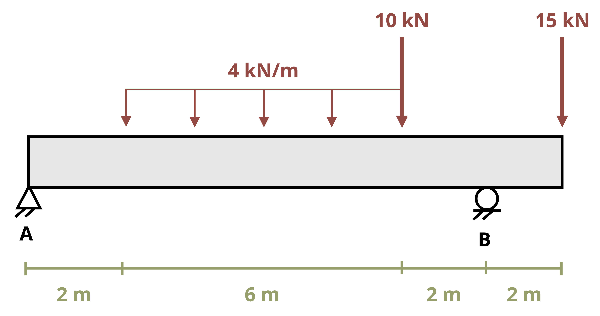
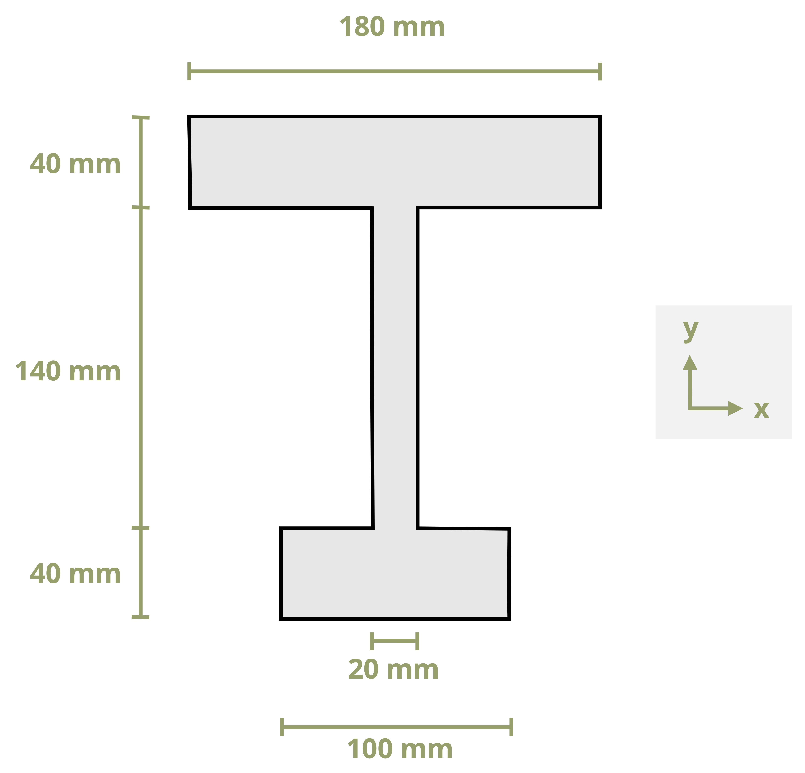
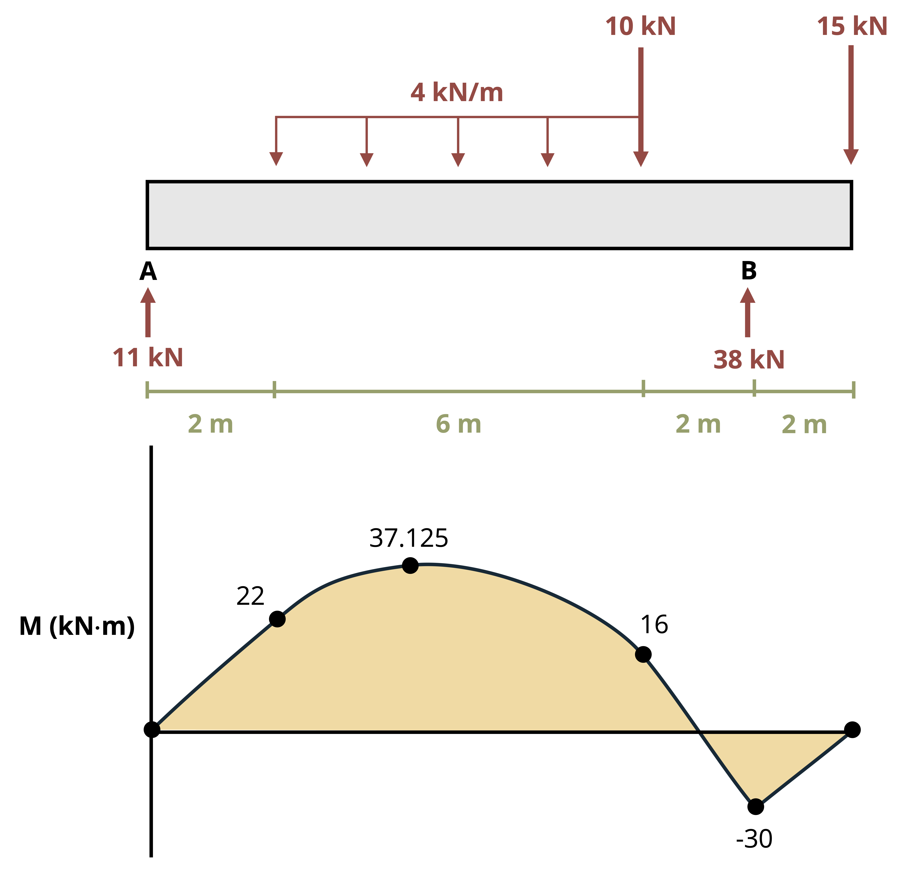

# Bending Loads {#sec-bending-loads}

::: {.callout-note icon="false"}
## Learning Objectives

-   Describe the bending behavior of beams
-   Calculate the bending stresses in beams
-   Select an adequate beam, using the section modulus
-   Analyze beams subjected to unsymmetric bending
:::

Beams are structural members that support loads along their length. Typically these loads are perpendicular to the axis of the beam and cause only shear forces and bending moments.

As discussed in previous chapters, internal forces and moments and section properties are crucial to calculating stresses and deflections. The same is true for finding stresses and deflections in beams. This chapter describes calculating bending stresses in beams, such as those in @fig-9.1, with considerations for unsymmetric bending and beam design.

{#fig-9.1 fig-alt="Isometric view looking underneath a bridge under construction, showing a series of long prestressed concrete girders spanning horizontally between two supports. The girders cast deep shadows on the gravel-covered ground below, forming a repetitive geometric pattern." fig-align="center" width="470"}

@sec-9.1 derives an equation for calculating bending stress. @sec-9.2 discusses how to design beams to ensure they don't fail due to bending stress. @sec-9.3 extends the analysis to include cases where the bending moment not only acts about the horizontal axis of the beam but has components about both the horizontal and the vertical axes.

## Bending Stress {#sec-9.1}

Click to expand

This section discusses bending behavior of straight, symmetric, homogeneous beams. Additionally, this section is limited to beams with a cross section that is symmetric with an axis and whose bending moment is around an axis that is perpendicular to the axis of symmetry. Examine the initially unaltered beam depicted in @fig-9.2, which is characterized by a rectangular cross-section and annotated with both horizontal and vertical grid lines.

{#fig-9.2 fig-alt="Horizontal rectangular grid with 5 rows and 20 columns of small blue squares, enclosed by a black border. The uniform array represents the rectangular cross section of an unloaded beam." fig-align="center" width="278"}

When a bending moment is applied, horizontal lines curve, whereas vertical lines remain straight but rotate, as illustrated in @fig-9.3. The material stretches at the bottom and compresses at the top, creating a neutral surface in between where fibers experience no length change. On a cross-section this surface appears as the neutral axis.

{#fig-9.3 fig-alt="Horizontal curved beam segment with a rectangular grid pattern, symmetric about a vertical axis through point O at the top. The beam forms a circular arc, with dashed lines connecting its ends to point O. Two curved arrows labeled M are placed at the arc ends: clockwise on the left and counterclockwise on the right, representing equal and opposite bending moments. The upper portion of the arc is shorter in length, showing compression, while the lower portion is longer, showing tension. A bold horizontal line through the center of the section marks the neutral axis, where fiber length remains unchanged." fig-align="center" width="269"}

We can make a similar observation when a kid's toy undergoes bending as shown in @fig-9.4. This toy is subjected to a bending moment in the opposite direction of the beam depicted in @fig-9.3, and this direction switches the behavior of the top and the bottom surfaces. Notice in @fig-9.4 that the fibers at the top are pulled apart whereas the bottom surface fibers are pushed together.

{#fig-9.4 fig-alt="A black-and-white photo of a metallic helical spring (slinky) arranged in a curved shape on a reflective surface. The spring’s coils loop symmetrically outward from the center, forming a tunnel-like pattern with tightly wound turns, illustrating the spring bent into an arching shape." fig-align="center" width="336"}

This knowledge about deformations due to bending can be applied to the failure of the column in @fig-9.5. Notice that the column was fixed at the base and subjected to a transverse force that caused failure. The fibers on the right side of the column failure point were pulled apart, whereas the fibers on the left side of the column failure point were compressed.

{#fig-9.5 fig-alt="A bent, rusted steel column lying on a debris-strewn concrete slab in an outdoor setting. The column has a pronounced curvature near midspan, indicating buckling or bending failure." fig-align="center" width="407"}

We make the following assumptions about deformations due to bending:

-   There must be a neutral surface parallel to both the upper and lower surfaces, where the length remains constant.

-   Throughout the deformation all cross sections of the beam remain plane and perpendicular to the longitudinal axis.

-   The cross section will keep its shape (we'll ignore the Poisson effects discussed in @sec-4.4 of this text).

{#fig-9.6 fig-alt="Horizontal curved beam segment, symmetric about a vertical axis through point O at the top. The beam forms a circular arc with dashed lines connecting its ends to point O. Two curved arrows labeled M act at the ends: clockwise on the left and counterclockwise on the right, representing equal and opposite bending moments. The neutral surface is shown as arc AB, a horizontal arc through the middle of the rectangular cross section, with A on the left and B on the right. Point C lies at the midpoint of arc AB, where coordinate axes x and y are drawn. Above A, at a vertical distance y, is point A′, and a dashed arc extends from A′ to B′. The distance from O to A is labeled rho, and from O to A′ is rho minus y. The angle between the dashed lines at O is labeled d theta." fig-align="center" width="334"}

To understand bending stress in a beam subjected to arbitrary loads, examine a small element extracted from the beam as shown in @fig-9.6. The derivation of the bending strain equation remains unaffected by the beam type or specific loads. Remember the fundamental definition of normal strain is

$$
\varepsilon=\frac{\Delta L}{L}\text{ .}
$$

This equation can be used to calculate the normal strain along AB in the beam.

$$
\varepsilon=\frac{\overline{A^{\prime} B^{\prime}}-\overline{A B}}{\overline{A B}}
$$

Distance y is measured relative to the neutral surface and is positive above the neutral surface and negative below. Before bending, line AB is the same length at all y values. During bending, though, line A’B’ shortens above the neutral surface and lengthens below it. By definition the length of the neutral surface doesn't change and remains the same as length AB. The lengths AB and A'B' can be described using the radius of curvature (ρ) and the differential angle (dθ) shown in @fig-9.6.

$$
\begin{gathered}
\overline{A B}=\rho d \theta \\
\overline{A^{\prime} B^{\prime}}=(\rho-y) d \theta
\end{gathered}
$$

Now we substitute these lengths into the strain equation.

$$
\varepsilon=\frac{(\rho-y) d \theta-\rho d \theta}{\rho d \theta}
$$

Simplifying the equation yields

$$
\begin{gathered}
\varepsilon=\frac{\rho d \theta-y d \theta-\rho d \theta}{\rho d \theta} \\
\varepsilon=\frac{-y d \theta}{\rho d \theta} \\
\varepsilon=-\frac{y}{\rho}
\end{gathered}
$$

This relationship shows us that the longitudinal strain, ε, varies linearly with the distance, y, from the neutral surface. The maximum stress occurs at the outermost fibers, the extreme top and bottom of the section. This maximum distance from the neutral surface is designated c. A relationship for the maximum absolute value of the strain, ε~max~ can now be calculated.

$$
\begin{gathered}
\frac{\varepsilon}{\varepsilon_{\max }}=-\frac{y / \rho}{c / \rho} \\
\varepsilon=-\left(\frac{y}{c}\right) \varepsilon_{\max }
\end{gathered}
$$

Assuming that the material behaves in a linearly elastic manner, we use Hooke's law, $\sigma = E \epsilon$, to rewrite the strain relationship into a relationship of stresses.

$$
\sigma=-\left(\frac{y}{c}\right) \sigma_{\max }
$$

Therefore, similar to the variation in normal strain, normal stress, σ, will fluctuate from zero at the neutral surface to a maximum value, σ~max~, at a distance c from the neutral surface as shown in @fig-9.7.

{#fig-9.7 fig-alt="A horizontal rectangular cross section is shown with x- and y-axes. The x-axis is horizontal and aligned with the dashed neutral surface, which passes through the middle of the section. Arrows in the top half point left, representing compressive stresses, while arrows in the bottom half point right, representing tensile stresses. The arrows are longest at the outer edges and decrease linearly toward the neutral surface. A vertical double-headed arrow labeled c marks the distance from the neutral surface to the outermost fiber." fig-align="center" width="429"}

For us to determine the position of the neutral surface, the resultant force generated by the stress distribution across the cross-sectional area must be equal to zero.

$$
0=\int_A F_{resultant}=\int_A \sigma d A
$$

We can now substitute the previous relationship between stress and distance from neutral axis.

$$
\begin{aligned}
& 0=\int_A-\left(\frac{y}{c}\right) \sigma_{\max } d A \\
& 0=-\frac{\sigma_{\max }}{c} \int_A y d A
\end{aligned}
$$

Since $-\frac{\sigma_{\max }}{c}$ does not equal zero, what remains is

$$
0=\int_A y d A
$$

This integral represents the first moment of area, as discussed in @sec-8.1. This equation indicates that the first moment of the cross-section about its neutral axis must be zero. Recall that the location of the centroid was determined by $\bar{y}=\frac{\int_A y d A}{A}$. Consequently, for a member experiencing pure bending and as long as the stresses remain within the elastic range, the neutral axis traverses through the centroid of the section because $\bar{y}$ (the distance from the neutral axis to the centroid) is zero.

The stress in the beam can be ascertained by setting the moment M equal to the moment produced by the stress distribution around the neutral axis.

$$
d M=y d F
$$

Since

$$
d F=\sigma d A\text{ ,}
$$

we can write

$$
\begin{gathered}
M=\int_A y d F=\int_A y(\sigma d A)=\int_A y\left(-\frac{y}{c} \sigma_{\max }\right) d A \\
M=\frac{\sigma_{\max }}{c} \int_A y^2 d A
\end{gathered}
$$

Note that the integral, $\int_A y^2 d A$, represents the second moment of area, or the moment of inertia, of the cross-sectional area about the neutral axis. Here second moment of area is denoted with I, as in @sec-8.2.

Rearranging the previous equation to obtain the flexure formula yields

$$
\boxed{\sigma_{\max }=\frac{M c}{I}}\text{ ,}
$$ {#eq-9.1}

| where
| *σ~max~ = Maximum bending stress in the beam; note that a complete description includes magnitude, units, and tension or compression \[Pa, psi\]*
| *M = Internal bending moment calculated about the neutral axis of the cross section, determined from method of sections or shear and moment diagrams \[N·m, lb·in.\]*
| *c = Perpendicular distance from the neutral axis to the point farthest from the neutral axis \[m, in.\]*
| *I = Second moment of area about the neutral axis \[m^4^, in.^4^\]*

Previous derivation has shown that

$$
\sigma=-\left(\frac{y}{c}\right) \sigma_{\max }
$$

This can be rearranged to provide the following relationship:

$$
\frac{\sigma_{\max }}{c}=-\frac{\sigma}{y}
$$

We can determine a similar flexure formula to calculate the bending stress at any point along the cross section.

$$
\boxed{\sigma=-\frac{M y}{I}}\text{ ,}
$$ {#eq-9.2}

| where
| *σ = Bending stress \[Pa, psi\]*
| *M = Internal moment calculated about the neutral axis of the cross section \[N·m, lb·in.\]*
| *y = Perpendicular distance from the neutral axis to the point of interest \[m, in.\]*
| *I = Second moment of area about the neutral axis \[m^4^, in.^4^\]*

As emphasized in @sec-stress, when reporting normal stress engineers must indicate whether that stress is in tension or compression. The derivation for @eq-9.2 used a beam bending concave upward. In @sec-beams we indicated that this type of moment was considered positive. This leads to compression above the neutral axis and tension below. The inverse is true when the beam is subjected to negative bending moment as shown in @fig-9.8.

{#fig-9.8 fig-alt="Two bending diagrams are shown side by side. The left diagram illustrates a positive moment: the beam bends concave up, with compression at the top and tension at the bottom. Curved arrows at the ends indicate upward bending, clockwise on the left and counterclockwise on the right. The right diagram illustrates a negative moment: the beam bends concave down, with tension at the top and compression at the bottom. Curved arrows at the ends indicate downward bending, counterclockwise on the left and clockwise on the right. In both diagrams, a dashed line through the mid-height marks the neutral axis." fig-align="center" width="499"}

@exm-9.2 and @exm-9.3 demonstrate the calculation of bending stresses at various points on a cross-section.

::::: {.callout-tip collapse="true" icon="false"}
## Example 9.1

:::: {#exm-9.1}

For the timber beam shown, calculate the normal stress at the top, bottom, and at point A when the beam experiences a +30 kN·m moment.

{fig-alt="Vertical rectangular cross section with overall dimensions labeled. The section is 300 mm tall and 80 mm wide. Point A is marked 100 mm below the top edge." fig-align="center" width="243"}

::: {.callout-tip collapse="true" icon="false"}
## Solution

Since we are asked to find the bending stress, let’s look at the bending stress formula.

$$
{\sigma=-\frac{M y}{I}}
$$

Start with the internal moment, which is a given in the problem statement to be +30 kN·m. Positive moment indicates that the beam is bending concave up, with compression above the neutral axis and tension below.

{fig-alt="Curved beam segment with a thick blue shaded cross section. The beam bends concave upward, with the inner curve labeled Compression and the outer curve labeled Tension. The diagram illustrates positive bending, where the top fibers are in compression and the bottom fibers are in tension." fig-align="center" width="269"}

The value of *y* is the perpendicular distance from the neutral axis to the point of interest. This problem has three points of interest so it has three different y values—one each for the top, the bottom, and point A.

Next determine the beam properties, which are the centroid and the second moment of area. Since the cross section is a rectangle, the centroid is located at the midpoint of the beam's height. You can then use the formula for second moment of area for a rectangle from @sec-centroids-moments-inertia.

{fig-alt="Vertical rectangular cross section with overall dimensions labeled. The section is 300 mm tall and 80 mm wide. Point A is marked 100 mm below the top edge. A vertical dimension of 50 mm is shown from Point A down to the centroid, and another dimension of 150 mm is marked from the centroid to the bottom edge." fig-align="center" width="273"}

$$
\begin{gathered}
I_x=\frac{1}{12}(0.080m)(0.3m)^3 \\
I_x=1.8*10^{-4}*m^4
\end{gathered}
$$

Now calculate stress at each of the three points requested. Start with the top.

$$
\sigma_{top}=\frac{(30*10^3Nm)(0.15m)}{1.8*10^{-4}*m^4}=25 MPa
$$

A complete answer must include magnitude, units, and tension or compression. The magnitude is 25, the units will be MPa. To determine the tension or compression look at the sign of the internal moment and where along the section you are calculating the bending stress. In this example the moment is positive and we calculated the stress at the top of the section.

The calculation shows the bending stress to be in compression.

{fig-alt="Curved beam segment with a thick blue shaded cross section. The beam bends concave upward, with the inner curve labeled Compression and the outer curve labeled Tension. The diagram illustrates positive bending, where the top fibers are in compression and the bottom fibers are in tension." fig-align="center" width="265"}

$$
\sigma_{top}=25MPa (C)
$$

Note that as long as care is taken to use the correct signs for M and y (both positive in this case), the answer will come out with the correct sign (negative in this case, which indicates compression).

Next calculate the normal stress at the bottom of the beam. In this case all the values (M, y, and I) are the same, so the magnitude of the stress is the same (25 MPa). What changes is the type of stress (tension or compression). Since in this example the moment is positive and we calculated the stress at the bottom of the beam, the stress will be in tension.

$$
\sigma_{BTM}=25MPa(T)
$$

Finally, calculate the stress at point A, which is located 100 mm from the top of the section. The y value measures from the neutral axis (centroid), so use y = 50 mm.

$$
\sigma_{A}=\frac{(30*10^3Nm)(0.05m)}{1.8*10^{-4}*m^4}=8.33 MPa
$$

As before, evaluate whether the stress is in tension or compression. Since point A is above the neutral axis and the moment is positive, the stress at point A will be in compression.

$$
\sigma_A=8.33MPa(C)
$$
:::
::::
:::::

::::: {.callout-tip collapse="true" icon="false"}
## Example 9.2

:::: {#exm-9.2}

A beam with the shown cross section is subjected to a positive moment of 50 k·in.

Calculate the normal stress at the top, bottom, and interface between flange and web.

{fig-alt="T-shaped composite section with overall dimensions. The top flange is horizontal, 9 inches wide and 1.5 inches tall. The vertical stem is centered beneath the flange, 3 inches wide and 4.5 inches tall. The entire section is shaded gray to indicate it is solid." fig-align="center" width="292"}

::: {.callout-tip collapse="true" icon="false"}
## Solution

Start with the internal moment, which is given in the problem statement as +50k·in. The positive moment indicates that the beam is bending concave up, with compression above the neutral axis and tension below.

{fig-alt="Curved beam segment with a thick blue shaded cross section. The beam bends concave upward, with the inner curve labeled Compression and the outer curve labeled Tension. The diagram illustrates positive bending, where the top fibers are in compression and the bottom fibers are in tension." fig-align="center" width="267"}

Next determine the beam properties, which are the centroid and the second moment of area. Since this is not a standard shape and the shape is not symmetric in the y direction, you will need to calculate this by hand. @exm-8.1 and @exm-8.4 cover this shape in detail.

{fig-alt="Same T-shaped composite section divided into two rectangles labeled 1 and 2. Rectangle 1 is the vertical stem, and Rectangle 2 is the horizontal flange. A black point labeled RP marks the reference point at the bottom left corner of the stem. Dimensions remain the same: the stem is 3 inches wide and 4.5 inches tall, and the flange is 9 inches wide and 1.5 inches tall." fig-align="center" width="270"}

| Shape | $A {~(in.^2})$ | $\bar{y}{~(in.})$ | $A\bar{y}{~(in.^3})$ | $I_x{~(in.^4})$ | $d_y{~(in.})$ | $I_x+Ad_y^2{~(in.^4})$ |
|----------|----------|----------|----------|----------|----------|----------|
| 1 | 13.5 | 2.25 | 30.375 | 22.78125 | 1.5 | 53.15625 |
| 2 | 13.5 | 5.25 | 70.875 | 2.53125 | 1.5 | 32.90625 |
|  | $\sum A$ = 27 |  | $\sum A\bar{y}$ = 101.25 |  |  | $\sum I_{x}$ = 86.0625 |

$$
\begin{aligned}
\bar{Y}=\frac{101.25{~in.^3}}{27{~in.^2}} & =3.75{~in.}~~\text{from bottom} \\
& =2.25{~in.}~~\text{from top} \\
\end{aligned}
$$

This problem has three parts that change the y value. Begin by calculating the stress at the top of the section, using the flexure formula.

$$
\sigma_{t o p}=-\frac{M y}{I}
$$

Before plugging in our values, ensure that the units are consistent.

-   $M = 50{~kip}\cdot{in.}$

-   $y = 2.25{~in.}$

-   $I = 86.0625{~in.^4}$

Since all units are in kips and inches, plug them into the flexure formula.

$$
\sigma_{top}=-\frac{(50{~kip}\cdot{in.})(2.25{~in.})}{86.0625{~in.}^4}=-1.31{~ksi}
$$

For a complete answer include magnitude, units, and tension or compression. The magnitude is 1.31, the units will be kips/in^2^ or ksi. To determine the tension or compression look at the sign of the internal moment and where along the section you are calculating the bending stress. In this example the moment is positive, so calculate the stress at the top of the section. The answer will show the bending stress to be in compression.

{fig-alt="Curved beam segment with a thick blue shaded cross section. The beam bends concave upward, with the inner curve labeled Compression and the outer curve labeled Tension. The diagram illustrates positive bending, where the top fibers are in compression and the bottom fibers are in tension." fig-align="center" width="268"}

$$
\sigma_{top}=1.31{~ksi}~(C)
$$

Note that as long as care is taken to use the correct signs for M and y (both positive in this case), the answer will come out with the correct sign (negative in this case, which indicates compression).

Now calculate the normal stress at the bottom of the beam. The only quantity that changes is the y value, so now use the distance from the neutral axis to the bottom of the beam (3.75 in.).

$$
\sigma_{btm}=-\frac{(50{~kip}\cdot{in.})(-3.75{~in.})}{86.0625{~in.}^4}=2.18{~ksi}
$$

Because the moment is positive, the beam bends concave up. Anything below the neutral axis is in tension.

$$
\sigma_{btm}=2.18{~ksi}~(T)
$$

This again works mathematically as long as you use the correct positive sign for the M and negative sign for y (since the point of interest is below the neutral axis). The answer shows this stress to be positive, indicating tension and matching expectation.

Finally, calculate the normal stress at the junction of the flange and the web. To do this find the distance from the neutral axis to the flange web junction.

{fig-alt="T-shaped composite section with overall dimensions. The top flange is 9 inches wide and 1.5 inches tall. The vertical stem, centered beneath the flange, is 3 inches wide and 4.5 inches tall." fig-align="center" width="324"}

{fig-alt="Same as image above, except this one isolates the vertical stem as a rectangle. A horizontal dashed line labeled Neutral axis intersects the rectangle, located 0.75 inches below the top edge, calculated as 4.5 minus 3.75. The distance from the bottom of the stem to the neutral axis is labeled as 3.75 inches." fig-align="center" width="449"}

$$
\sigma_{F / w}=-\frac{(50{~kip}\cdot{in.})(0.75{~in.})}{86.0625{~in.}^4}=-0.436{~ksi}
$$

Since the flange web junction is above the neutral axis and the beam is subjected to positive moment, the bending stress will be in compression.

$$
\sigma_{F/w}=0.436{~ksi}~(C)
$$
:::
::::
:::::

::::: {#example-9.2 .callout-tip collapse="true" icon="false"}
## Example 9.3

:::: {#exm-9.3}

Calculate the maximum tensile and maximum compressive bending stress in the beam shown.

{fig-alt="A simply supported beam with a triangular pin support at point A on the far left and a circular roller support at point B, located 10 meters from A. A uniformly distributed load of 4 kilonewtons per meter is applied over a 6-meter span, starting 2 meters to the right of A and ending 2 meters before B. At the same location, a concentrated 10 kilonewton downward force is applied. Another 15 kilonewton downward force is applied at the far right end of the beam, 12 meters from A and 2 meters to the right of B." fig-align="center" width="364"}

{fig-alt="A symmetric I-shaped cross section, symmetric about the vertical y-axis but not the horizontal x-axis. The top flange is 180 mm wide and 40 mm high. The central web is 20 mm wide and 140 mm high. The bottom flange is 100 mm wide and 40 mm high. All components are vertically aligned and centered along the y-axis. A coordinate system is drawn to the right, with the x-axis pointing horizontally and the y-axis pointing upward." fig-align="center" width="370"}

::: {.callout-tip collapse="true" icon="false"}
## Solution

The first step is to find the beam's internal forces so that we can find the maximum positive and negative moments. The best way to do this is to draw the moment diagram, as detailed in @exm-7.3.

{fig-alt="Top: Free body diagram of a simply supported beam. At point A on the far left, the pin support provides an 11 kilonewton upward reaction. At point B, a roller support 10 meters from A provides a 38 kilonewton upward reaction. A uniformly distributed load of 4 kilonewtons per meter is applied over a 6-meter span, starting 2 meters to the right of A and ending 2 meters before B. At the same location, a 10 kilonewton concentrated downward force is applied. At the far right end, 12 meters from A and 2 meters beyond B, a 15 kilonewton downward force is applied. Bottom: A bending moment diagram shaded in orange with a parabolic curve. Key values are marked: zero at point A, 22 kilonewton-meters at 2 meters, a maximum of 37.125 kilonewton-meters at approximately 4.75 meters, 16 kilonewton-meters at 8 meters, -30 kilonewton-meters at point B (10 meters), and zero again at the far right end." fig-align="center" width="366"}

Note that the maximum positive moment is 37.125 kN·m and the maximum negative moment is 30 kN·m.

Next determine the beam's geometric properties, which are the centroid and the second moment of area. Since this is not a standard shape and the shape is not symmetric in the y direction, calculate this by hand. @exm-8.2 and @exm-8.5 covered this shape in detail.

{fig-alt="A symmetric I-shaped cross section, symmetric about the vertical y-axis but not the horizontal x-axis. The top flange is 180 mm wide and 40 mm high. The central web is 20 mm wide and 140 mm high. The bottom flange is 100 mm wide and 40 mm high. All components are vertically aligned and centered along the y-axis. A coordinate system is drawn to the right, with the x-axis pointing horizontally and the y-axis pointing upward." fig-align="center" width="360"}

Find the centroid ($\bar{x} = 0$ due to symmetry).

| Shape | $A{~(mm}^2)$      | $\bar{y}{~(mm})$ | $A\bar{y}{~(mm^3})$         |
|-------|-------------------|------------------|-----------------------------|
| 1     | 4,000             | 20               | 80,000                      |
| 2     | 2,800             | 110              | 308,000                     |
| 3     | 7,200             | 200              | 1,440,000                   |
|       | $\sum A$ = 14,000 |                  | $\sum A\bar{y}$ = 1,888,000 |

$\bar{Y}=130.6{~mm}~~\text{from bottom}$

| Shape | $I_x{~(mm^4})$ | $d_y{~(mm})$ | $I_x+Ad_y^2{~(mm^4)}$   |
|-------|----------------|--------------|-------------------------|
| 1     | 533,333        | 110.57       | 49,436,233              |
| 2     | 4,573,333      | 20.57        | 5,758,083               |
| 3     | 960,000        | 69.43        | 35,667,779              |
|       |                |              | I~x~ = 90,862,095 mm^4^ |

The positive bending moment will cause compression at the top of the cross-section and tension at the bottom. The negative bending moment will cause tension at the top and compression at the bottom. It's not obvious by inspection which of these two tensile stresses will be larger, nor which of the two compressive stresses will be larger. We should calculate all four to compare.

Before plugging in the values, ensure that the units are consistent, so change everything to Newtons and meters.

-   M~pos~ = 37.125 kN·m = 37.125 x 10^3^ N·m

-   M~neg~ = 30 kN·m = 30 x 10^3^ N·m

-   y~top~ = 89.43 mm = 0.08943 m

-   y~btm~ = 130.57 mm = 0.13057 m

-   I~x~ = 90,862,095 mm^4^ = 90.862095 x 10^-6^ m^4^

Start by calculating the section's top and bottom stress from the maximum positive moment, using the flexure formula.

$$ \sigma=-\frac{M y}{I} $$

{fig-alt="Curved beam segment with a thick blue shaded cross section. The beam bends concave upward, with the inner curve labeled Compression and the outer curve labeled Tension. The diagram illustrates positive bending, where the top fibers are in compression and the bottom fibers are in tension." fig-align="center" width="278"}

$$ \sigma_{top/pos}=-\frac{\left(37.125 \times 10^3{~N}\cdot{m}\right)(0.0893 {~m})}{90.86 \times 10^{-6}{~m}^4}=-36.49{~MPa~(C)} $$

$$ \sigma_{btm/pos}=-\frac{\left(37.125\times10^3{~N}\cdot{m}\right)(-0.13057{~m})}{90.86 \times 10^{-6}{~m}^4}=53.35{~MPa}{~(T)} $$

Now do something similar for the maximum negative bending stress.

{fig-alt="Curved beam segment with a thick blue shaded cross section. The beam bends concave downward, with the top curve labeled Compression and the bottom curve labeled Tension. The diagram illustrates negative bending, where the top fibers are in compression and the bottom fibers are in tension." fig-align="center" width="262"}

$$ \sigma_{top/neg}=-\frac{\left(-30 \times 10^3{~N}\cdot{m}\right)(0.0893{~m})}{90.86 \times 10^{-6}{~m}^4}=29.48{~MPa~(T)} $$

$$ \sigma_{btm/neg}=-\frac{\left(-30 \times 10^3 \mathrm{~N}\cdot{m}\right)(-0.13057{~m})}{90.86 \times 10^{-6}{~m}^4}=-43.11{~MPa}~{(C)} $$

The overall maximum tensile stress for this beam occurs at the bottom of the section due to positive moment, 53.35 MPa (T). The overall maximum compressive stress (43.11 MPa (C)) also occurs at the bottom of the section in a different part of the beam but is due to the negative moment.
:::
::::
:::::

For many situations the overall largest stress would be sufficient. However, some materials behave differently depending on whether they are subjected to tensile or compressive stress. Concrete is a good example of this, as it's relatively strong against compressive stresses but very weak against tensile stresses. Steel rebar is placed inside concrete members to support the tensile stresses as shown in @fig-9.9. At this point in your engineering career it is good practice to report both the maximum tensile and compressive stresses at each critical point on the beam.

.jpg){#fig-9.9 fig-alt="A close-up view of a prestressed concrete girder under construction is shown. Multiple steel tendons extend horizontally from the end of the beam, protruding from anchor heads embedded in the girder. The tendons are arranged in an organized pattern and will eventually be tensioned and anchored to provide prestressing force." fig-align="center" width="493"}

::: {.callout-warning icon="false"}
## Step-by-Step: Calculating Bending Stress

1.  Determine the **internal moment** at the point where you want to calculate the bending stress. If you know the point along the length of the beam that you are investigating, you can cut a section and apply equilibrium equations to determine this moment. If you need to find the maximum bending stress, then draw the moment diagram to find the maximum internal moment (@sec-beams reviews this).
2.  Determine the section properties of the beam. This will require knowing the location of the centroid, neutral axis, and second moment of area. (See @sec-geometric-properties for a review or @sec-centroids-moments-inertia for a table listing I values for selected common shapes.)
3.  Identify the specific location on the section for which you are computing the normal stress, y (or c, if you are calculating the maximum normal stress.)
4.  Ensure that the units of M, I, and y (or c) are consistent, then use one of the flexure formulas to calculate bending stress. Ensure that the result indicates the magnitude, units, and tension or compression.
:::

## Beam Design for Bending {#sec-9.2}

Click to expand

Frequently beam design is governed by the bending moment. This section leverages your understanding of bending stress to design two common categories of beams capable of withstanding their applied internal moments. This section starts with rolled steel beams of varying cross sections. @sec-geometric-properties-of-standard-beams provides a sampling of these standard shapes. Then follows a discussion of rectangular cross-sections, which are common for timber beams.

A safe design requires that the allowable stress of the material used is greater than the stress due to the loading. The flexure equation for maximum bending stress, $\sigma_m=\frac{M_{\max } c}{I}$, has four variables: σ~m~, M~max~, c, and I. We'll start with the allowable stress of the material, σ~all~, and use the \|M~max~\| derived from the loading condition. What is left are section properties, I, and c. For standard shapes these are combined into one variable, section modulus (S).

$$
\boxed{S=\frac{I}{c}}
$$ {#eq-9.3}

We can substitute this value into the flexure formula and rearrange for S~min~, which is the minimum allowable value of the section modulus for the beam.

$$
\boxed{S_{min}=\frac{\left|M_{\max}\right|}{\sigma_{allow}}}\text{ ,}
$$ {#eq-9.4}

| where
| *Smin = Minimum required section modulus for a beam to resist the bending stress \[m^3^, in.^3^\]*
| *\|M~max~\| = Magnitude of the maximum internal bending moment \[N·m, lb·in.\]*
| *𝜎~allow~ = Maximum allowable stress for the beam \[Pa, psi\]*

### Design of Standard Steel Sections

As long as the beam is designed such that its section modulus is larger than S~min~, the beam is guaranteed not to fail due to bending stress. Rolled steel beams tend to have relatively complex cross-sections with multiple dimensions that can be varied to alter a beam's section modulus and therefore its resistance to bending stress. Designing each dimension individually would be time consuming and it would be costly to manufacture a unique beam for every loading condition.

Instead, beams are mass produced in standard sizes and engineers simply select the most appropriate beam for their specific need. Thus many safe standard steel shapes are available to satisfy this equation. Engineering is determining which of the shapes that work you will use. Often you will need to consider many criteria.

In this section we use cost to determine the shape. Steel beams are priced by their weight, and the higher the weight, the more expensive. To choose the most economical shape, we have selected the shape with the smallest weight (i.e., smallest cross-sectional area).

Basic structural steel shapes have standardized cross sectional dimensions. W shapes (standing for wide flange) are often used for beam design because they have an efficient cross section. @fig-9.10 is a sample of the beam table in @sec-geometric-properties-of-standard-beams.

{#fig-9.10 fig-alt="Cross-sectional view of a wide-flange I-beam with key geometric parameters labeled. The total height is marked d, the flange thickness is t sub f, the flange width is b sub f, and the web thickness is t sub w. The horizontal centroidal axis is labeled x, and the vertical symmetry axis is labeled y. Below the figure, a table lists dimensions, area, moments of inertia about the x- and y-axes, and radii of gyration r sub x and r sub y for different beam designations, including W40 × 431, W40 × 297, and W40 × 264." fig-align="center"}

Each beam has a designation that quickly gives us information about the section (see @fig-9.11).

{#fig-9.11 fig-alt="Wide-flange steel beam designation labeled ‘W12 × 96.’ The label is divided into three annotated parts: W indicates the shape type, a wide-flange section; 12 gives the approximate depth in inches; and 96 specifies the weight in pounds per foot. Bracketed annotations with descriptions are placed directly below each part of the designation." fig-align="center" width="368"}

Notice in the sample beam section table in @fig-9.10 that all are W shapes and grouped by approximate height (first number). Within each height grouping the shapes are arranged from lightest to heaviest (second number) when going from the bottom to top of the height grouping. Given for each standard shape in this table are the cross-sectional area, depth (height), flange and web dimensions, second moment of area in the x and y directions, section modulus in the x and y direction, and radius of gyration in the x and y directions (last is a geometric property related to buckling, used in @sec-columns).

In certain instances the selection of a section might be constrained by such factors as the permissible depth of the cross-section or the allowable deflection of the beam. Here the discussion is limited to materials that behave the same in tension and compression. If this is not the case (e.g., when using concrete), then you may need to check multiple points along the length of the beam. Additionally, if the section is not symmetric about the neutral axis, the maximum tensile and compressive stresses may not occur at the chosen place on the beam. Note that this procedure considers only bending stresses. Although bending stresses do control the design of most beams, there are instances where shear or deflection will be in control. @sec-beam-deflection discusses this topic further.

@exm-9.3 designs a wide-flange beam to resist bending stress.

::::: {#example-9.3 .callout-tip collapse="true" icon="false"}
## Example 9.4

:::: {#exm-9.4}

Knowing that the allowable normal stress for the steel used is 24 ksi, select the most economical wide-flange beam to support the loading shown.

{fig-alt="A simply supported beam spans horizontally from point A on the left (with a triangular support indicating a pinned support) to point B on the right (with a circular support indicating a roller). The beam is subjected to three loads: a concentrated vertical downward force of 8 kips applied 5 feet from point A, a concentrated vertical upward force of 5 kips applied 11 feet from point A, and a uniformly distributed load of 3 kips per foot applied over the final 6 feet of the span up to point B. The span is divided into segments labeled 5 ft, 6 ft, 3 ft, and 6 ft from left to right." fig-align="center" width="361"}

::: {.callout-tip collapse="true" icon="false"}
## Solution

The first step is to find the internal forces in the beam. We'll start by calculating the reactions.

{fig-alt="Simply supported beam with supports at points A (pin) and B (roller), spanning a total of 20 feet. Three vertical loads act on the beam: an 8 kip downward point load located 5 feet from point A, a 5 kip upward point load located 11 feet from point A, and a uniformly distributed load of 3 kips per foot applied over the final 6 feet of the span (from 14 to 20 feet). Reaction forces are labeled at each support: A sub x pointing left (horizontal), A sub y pointing up (vertical), and B sub y also pointing up. A horizontal dimension line below the beam divides the span into segments of 5 ft, 6 ft, 3 ft, and 6 ft, corresponding to the distances between the loads and supports." fig-align="center" width="365"}

$$
\begin{aligned}
\sum& F_x =A_x =0\\
\sum& M_A =-8{~kips}(5{~ft})+5{~kips}(11{~ft})-(3\frac{kips}{ft}*6{~ft})(17{~ft})+B_y(20{~ft})=0 \\
&B_y =14.55{~kips} \\
\sum& F_y=A_y-8{~kips}+5{~kips}-(3\frac{kips}{ft})*6{~ft})+14.55{~kips}=0 \\
&A_y=6.45{~kips}
\end{aligned}
$$

Now that we have the reactions, we can build the shear diagram.

Starting on the left side, go up the reaction at support A, 6.45 kips. Continue along the beam following the loads to finish the shear diagram.

{fig-alt="The top diagram shows a simply supported beam with a pin support at point A on the left and a roller support at point B on the right, spanning a total length of 20 feet. The beam is subjected to an 8 kip downward point load located 5 feet from A, a 5 kip upward point load located 11 feet from A, and a 3 kip-per-foot uniformly distributed load extending over the final 6 feet of the beam from 14 feet to 20 feet." fig-align="center" width="347"}

{fig-alt="A shear force diagram, starting at 6.45 kips, dropping to -1.55 kips after the 8 kip load, increasing to 3.45 kips after the upward 5 kip load, and decreasing linearly to -14.55 kips at the end due to the distributed load." fig-align="center" width="348"}

{fig-alt="A bending moment diagram in kip-feet is shown with a series of plotted points connected by curves, indicating the internal moment response along the span. The values on this moment diagram start at 0, go up to 32.25, down to 22.95, up to 33.3, up to 35.28, and down to 0. The diagrams together illustrate the effect of the applied point loads and distributed load on the internal shear and bending behavior of the beam." fig-align="center" width="347"}

To build the moment diagram calculate the area under the curve from the shear diagram using geometry. Calculate the area of three rectangles and two triangles.

$$
\begin{aligned}
& A_1=(6.45)(5)=32.25 \\
& A_2=(1.55)(6)=9.3 \\
& A_3=(3.45)(3)=10.35 \\
& \frac{18}{6}=\frac{3.45}{x} \quad\rightarrow\quad x=1.15{~ft,}~~~y=6-1.15=4.85 {~ft} \\
& A_4=\frac{1}{2}(1.15)(3.45)=1.98 \\
& A_5=\frac{1}{2}(4.85)(14.55)=35.28 \\
&
\end{aligned}
$$

From the moment diagram see that \|M~max~\| = 35.28 kip·ft. We will use this value and σ~all~ = 24 ksi (given in the problem statement) to calculate the minimum section modulus needed, *S~min~*.

$$
\begin{aligned}
& S_{min}=\frac{|M_{max}|}{\sigma_{allow}} \\
& S_{min}=\frac{(35.28{~kip}\cdot{ft})(12\frac{in.}{ft})}{24{~ksi}} \\
& S_{min}=17.64{~in.}^3
\end{aligned}
$$

Now that you know the minimum section modulus needed for this beam, go to the standard beam table in @sec-geometric-properties-of-standard-beams. Focusing on the S~x~ column, start at the bottom of the table to select one shape from each height section that is applicable.

For this beam the following sections will be adequate for bending:

-   W8 x 21

-   W10 x 19

-   W12 x 22

-   W14 x 22

Why not choose any from the W4, W5, and W6 groupings? Because none of these beams have a section modulus greater than 17.64 in^3^. Nor do we continue with groupings greater than W14 because those sections are far larger than what we need, as noted by the weight (second number in the designation).

Now choose the most economical beam by comparing the last number in the designation, which represents the weight per foot of the beam. The most economical section for this material and loading is the W10 x 19. This beam weighs 19 lb/ft and is the lightest of the beams selected.
:::
::::
:::::

::: {.callout-warning icon="false"}
## Step-by-Step: Most Economical Beam Design (standard shapes)

1.  Establish the allowable stress, σ~all~, value of sigma for the chosen material by referring to a table of material properties or consulting design specifications. Proceed with the following steps, assuming that σ~all~ is the same for tension and compression.
2.  Determine the maximum absolute value of the bending moment \|M~max~\| **i**n the beam by drawing the shear force and bending moment diagrams. (@sec-beams reviews this).
3.  Calculate the minimum allowable value of the section modulus using this equation: $S_{min}=\frac{\left|M_{\max }\right|}{\sigma_{all}}$.
4.  For a rolled steel beam refer to the relevant table in @sec-geometric-properties-of-standard-beams. Among the accessible beam sections focus solely on those with a section modulus surpassing the minimum value calculated in step 3, S **≥** S~min~. Start at the bottom of the table and select one beam in each height section (if applicable). Then from this short list choose the section with the smallest weight per unit length, as it represents the most economical option for which S **≥** S~min~. It's essential to note that this choice may not necessarily correspond to the section with the smallest S value.
:::

### Design of Rectangular Sections

Rectangular cross-sections are common for timber beams. Only two dimensions need to be specified, base and height. While there are standard rectangular cross-sections too (e.g., 2" x 4"), we'll approach the design of rectangular cross-sections by assuming that one dimension scales with the other, and so we need to specify only a single dimension. Rather than select from a list of standard cross-sections, we'll specify this required dimension exactly.

Calculate the minimum section modulus as before.

$$
S_{min}=\frac{\left|M_{max}\right|}{\sigma_{allow}}
$$

Now set this value:

$$
S_{min}=\frac{I}{c}
$$

For a rectangle, calculate

$$
\begin{gathered}
I=\frac{b h^3}{12} \\
c=\frac{h}{2}
\end{gathered}
$$

So the resulting equation is

$$
S_{min}=\frac{I}{c}=\frac{2 b h^3}{12 h}=\frac{b h^2}{6}
$$

Problems will be set up such that there is a relationship between b and h, which leaves only one unknown that can be solved for directly. This will be the minimum acceptable size for this dimension—anything larger than the calculated value will not fail due to bending stress.

@exm-9.4 designs a wooden beam with a rectangular cross-section to resist bending stress.

::::: {#example-9.4 .callout-tip collapse="true" icon="false"}
## Example 9.5

:::: {#exm-9.5}

A simply supported timber beam spans a gap of 10 m. It is subjected to a uniform distributed load w = 15 kN/m as shown. The beam has a rectangular cross-section and will be manufactured such that the height is two times the base.

Determine the minimum acceptable dimensions for the cross-section of this beam if the maximum allowable bending stress of the timber is 12 MPa.

{fig-alt="A simply supported beam is shown with a pin support on the left end and a roller support on the right end, spanning a total of 10 meters. The beam is subjected to a uniformly distributed load of 15 kN/m across the entire span. To the right of the beam, a cross-sectional shape is depicted as a vertical rectangle with width labeled as b and height labeled as h, where h equals 2b." fig-align="center" width="335"}

::: {.callout-tip collapse="true" icon="false"}
## Solution

The allowable stress is given as σ~all~ = 12 MPa. Determine the magnitude of the maximum internal bending moment by drawing the shear force and bending moment diagrams. Since the loading is symmetric, the total applied load of 15 · 10 = 150 kN will be split evenly between the two supports. The reaction force at each support will be 75 kN.

{fig-alt="The top diagram shows a simply supported beam subjected to a uniform distributed load of 15 kN/m across its entire span. The beam has equal vertical reaction forces of 75 kN at both ends. Below the beam, the shear force diagram (labeled V in kN) shows a linear decrease from +75 kN at the left support to -75 kN at the right support, crossing zero at the midpoint (x = 5 m). At the bottom, the bending moment diagram (labeled M in kN·m) is a symmetric parabola peaking at 187.5 kN·m at the center of the span (x = 5 m), indicating maximum moment at midspan." fig-align="center" width="332"}

The magnitude of the maximum internal bending moment \|M~max~\| = 187.5 kN·m.

Now determine the required section modulus. Be careful with the order of magnitude of the bending moment and allowable stress.

$$
S_{min}=\frac{187.5\times10^3{~N}\cdot{m}}{12\times10^6\frac{N}{m^2}}=0.015625{~m}^3
$$

Use this value to determine the required dimensions of the cross-section. Recall that h = 2b for this beam.

$$
\begin{gathered}
S_{min}=0.015625{~m^3}=\frac{b h^2}{6}=\frac{b(2 b)^2}{6}=\frac{4 b^3}{6}=\frac{2}{3} b^3 \\
b^2=\frac{3}{2} * 0.015625{~m^3}=0.0234375{~m^3} \\
b=~^3\sqrt{0.0234375}=0.286{~m} \\
b=286{~mm} \\
h=2b=2 * 286=572{~mm}
\end{gathered}
$$

The minimum required dimensions to ensure this beam doesn't fail due to bending stress are b = 286 mm and h = 572 mm.
:::
::::
:::::

For the purposes of this text it is appropriate to give exact answers to three significant figures. In practice we wouldn't generally specify the required dimension down to the mm since this is unnecessarily precise to manufacture. It is more practical to design to perhaps the nearest 10 mm, remembering to always round up. For example, we calculated the required dimension b = 153 mm. We must not round this down to 150 mm because this is below the required value, but rounding up to 160 mm would be acceptable. While not included in this problem, a factor of safety (@sec-4.8) is included in all designs in practice.

::: {.callout-warning icon="false"}
## Step-by-Step: Most Economical Beam Design (rectangular sections)

1.  Establish the allowable stress, σ~all~, value of sigma for the chosen material by referring to a table of material properties or consulting design specifications. Proceed with the following steps, assuming that σ~all~ is the same for tension and compression.
2.  Determine the maximum absolute value of the bending moment \|M~max~\| in the beam by drawing the shear force and bending moment diagrams (@sec-beams reviews this).
3.  Calculate the minimum allowable value of the section modulus using this equation: $S_{min}=\frac{\left|M_{max}\right|}{\sigma_{allow}}$.
4.  Set this $S_{\min }=\frac{b h^2}{6}$, substitute in the given relationship between b and h and solve for the unknown dimension.
:::

## Unsymmetric Bending—Moment Arbitrarily Applied {#sec-9.3}

Click to expand

Occasionally a member may experience loading where the bending moment, M, doesn't align with one of the cross-section's principal axes. In such cases it is advisable to initially resolve the moment into components along the principal axes. The flexure formula can subsequently be applied to ascertain the normal stress induced by each moment component. Finally, employing the principle of superposition helps us determine the resultant normal stress at the specific point.

{#fig-9.12 fig-alt="Decomposition of a moment vector applied to a rectangular cross-section, consisting of three diagrams labeled A and B. In diagram A (on the left), a gray rectangular section is shown with coordinate axes: the y-axis points upward, the z-axis points leftward, and the moment vector M originates at the centroid, inclined at an angle θ from the z-axis toward the y-axis. Diagram A represents the resultant moment vector. Diagrams B (center and right) show the two orthogonal components that add up to form diagram A: the center diagram displays M sub z, a horizontal component directed leftward along the z-axis, and the right diagram shows M sub y, a vertical component directed upward along the y-axis. Together, the two B diagrams vectorially sum to the moment M shown in A, demonstrating that A = B sub 1 + B sub 2." fig-align="center" width="524"}

To systematize this process, envision a beam with a rectangular cross-section subjected to a moment, M, as depicted in @fig-9.12 (A). Here M forms an angle, θ, with the maximum principal z-axis, which is the axis of maximum second moment of area for the cross-section. It is assumed that θ is positive when directed from the positive z-axis toward the positive y-axis. We can resolve M into y and z components.

$$
\begin{aligned}
& M_z=M \cos \theta \\
& M_y=M \sin \theta
\end{aligned}
$$

@fig-9.12 (B) shows the components of M acting on the rectangular cross section. It's important to keep track of which side of the beam is in compression and which is tension when subjected to both M~z~ and M~y~. Here we'll use tensile stress as positive and compressive stress as negative. Looking at a +M~z~ shows us that this moment causes the top of the section to be in compression and the bottom of the section to be in tension. Inspecting the section when subjected to +M~y~ reveals that the left side will be in tension whereas the right side will be in compression. Combining what we know about the sign convention with the flexure formula, we can calculate the resultant normal stress at any point on the cross section by using the following equation:

$$
\boxed{\sigma=-\frac{M_z y}{I_z}+\frac{M_y z}{I_y}}\text{ ,}
$$ {#eq-9.5}

| where
| *𝜎 = Bending stress at point of interest \[Pa, psi\]*
| *M~z~, M~y~ = Internal bending moment components about the z-axis and the y-axis \[N·m, lb·in.\]*
| *y, z = Distance in the y and z directions from the centroid to the point of interest \[m, in.\]*
| *I~z~, I~y~ = Second moment of area about the centroidal z-axis and y-axis \[m^4^, in.^4^\]*

Note that for the signs to work correctly we must assign the appropriate sign to the y and z values and to the components of the bending moment. These values are measured from the coordinate system that originates at the centroid where the x-axis is coming out of the page. It's also possible to ignore all the signs and use your spatial awareness to determine if each term is in tension or compression due to the applied moment.

Previously we identified the neutral axis—a line marking points of zero stress. When the bending moment acted around the horizontal axis, the neutral axis was also horizontal and passed through the centroid of the cross-section. When the bending moment acts at an angle (θ) from the horizontal axis, the neutral axis will pass through the centroid but will not be horizontal. It too will be at an angle (α).

Let's now determine the orientation of the neutral axis, as this will commonly not coincide with the axis of bending moment.

Derive the orientation of the neutral axis by setting the previous normal stress equation equal to zero.

$$
0=-\frac{M_z y}{I_z}+\frac{M_y z}{I_y}
$$

Then rearrange this to solve for y.

$$
y=\frac{M_y I_z}{M_z I_y} z
$$

Now put this equation in terms of M by using $M_z=M \cos \theta$ and $M_y=M \sin \theta$.

$$
y=\left(\frac{I_z}{I_y} \tan \theta\right) z
$$

Since the slope of the line is $\tan \alpha=y / z$, where the angle α represents the angle the neutral axis forms with the z-axis, this can be written as:

$$
\boxed{tan(\alpha)=\left(\frac{I_z}{I_y}tan~\theta\right)}\text{ ,}
$$ {#eq-9.6}

| where
| *𝛼 = Orientation of the neutral axis, measured from the z-axis \[*$^\circ$*,* rad*\]*
| *𝜃 = Orientation of the internal bending moment, measured from the z-axis \[*$^\circ$*,* rad*\]*
| *I~z~, I~y~ = Second moment of area about the centroidal z-axis and y-axis \[m^4^, in.^4^\]*

@exm-9.5 and @exm-9.6 demonstrate how to calculate bending stress at various points on a cross-section when the moment is arbitrarily applied.

::::: {#example-9.5 .callout-tip collapse="true" icon="false"}
## Example 9.6

:::: {#exm-9.6}

A bending moment M = 400 kip⸱in. is applied around an axis 65° above the negative z-axis as shown.

Determine the bending stress at corners A, B, C, and D. Also determine the orientation of the neutral axis with respect to the z-axis.

{fig-alt="A rectangle labeled ABCD is shown with a width of 15 inches along the horizontal z-axis and a height of 8 inches along the vertical y-axis. Dashed green lines represent the y- and z-axes intersecting at the centroid of the rectangle. A diagonal dashed green line extends from the center at a 65° angle above the z-axis, toward the top right. Along this line, a curved blue arrow indicates a clockwise moment labeled M = 400 kip-in. Points A, B, C, and D mark the four corners of the rectangle, each indicated by a black dot." fig-align="center" width="404"}

::: {.callout-tip collapse="true" icon="false"}
## Solution

We first determine the components of the bending moment around the y-axis and the z-axis.

$$
\begin{aligned}
& M_y=400 \sin(65^{\circ})=362.5{~kip}\cdot{in.} \\
& M_z=-400 \cos(65^{\circ})=-169.0{~kip}\cdot{in.}
\end{aligned}
$$

We'll also need the second moment of area around both axes.

$$
\begin{gathered}
I_y=\frac{8 * 15^3}{12}=2,250{~in.}^4 \\
I_z=\frac{15 * 8^3}{12}=640{~in.}^4
\end{gathered}
$$

Now we can calculate the stress at each corner by using

$$
\sigma=-\frac{M_z y}{I_z}+\frac{M_y z}{I_y}
$$

Pay close attention to the signs used for each term.

Corner A:

$$
\sigma_A=-\frac{-169.0{~kip}\cdot{in.} *-4{~in.}}{640{~in.}^4}+\frac{362.5{~kip}\cdot{in.} * 7.5{~in.}}{2,250{~in.}^4}\\ \sigma_A=-1.06{~ksi}+1.21{~ksi}=0.15{~ksi}=0.15{~ksi}~(T)
$$

Corner B:

$$
\sigma_B=-\frac{-169.0{~kip}\cdot{in.} * 4{~in.}}{640{~in.}^4}+\frac{362.5{~kip}\cdot{in.} * 7.5{~in.}}{2,250{~in.}^4}\\ \sigma_B=1.05{~ksi}+1.21{~ksi}=2.26{~ksi}=2.26{~ksi }~(T)
$$

Corner C:

$$
\sigma_C=-\frac{-169.0{~kip}\cdot{in.} * 4{~in.}}{640{~in.}^4}+\frac{362.5{~kip}\cdot{in.} *-7.5{~in.}}{2,250{~in.}^4}\\ \sigma_C=1.06{~ksi}-1.21{~ksi}=-0.15{~ksi}=0.15{~ksi}~(C)
$$

Corner D:

$$
\sigma_D=-\frac{-169.0{~kip}\cdot{in.} *-4{~in.}}{640{~in.^4}}+\frac{362.5{~kip}\cdot{in.} *-7.5{~in.}}{2,250{~in.}^4}\\ \sigma_D=-1.05{~ksi}-1.21{~ksi}=-2.26{~ksi}=2.26{~ksi}~(C)
$$

Note that the symmetry of the cross-section causes the stresses at diagonally opposite corners to have the same magnitude but opposite signs. This situation can shorten the problem, enabling us to calculate the stresses at only two corners (say A and B) and identify the stresses at the opposite corners.

{fig-alt="A rectangle is centered on the coordinate system defined by the vertical y-axis and horizontal z-axis, both represented with dashed lines intersecting at the centroid. A diagonal solid line labeled Neutral axis passes through the rectangle at an upward angle to the right, forming an angle of 31.4° above the z-axis." fig-align="center" width="384"}

The orientation of the neutral axis is found from

$$
\begin{gathered}
\tan (\alpha)=\frac{I_z}{I_y} \tan (\theta) \\
\alpha=\tan ^{-1}\left(\frac{640{~in.}^4}{2,250{~in.}^4} \tan \left(65^{\circ}\right)\right)=31.4^{\circ}
\end{gathered}
$$
:::
::::
:::::

::::: {#example-9.6 .callout-tip collapse="true" icon="false"}
## Example 9.7

:::: {#exm-9.7}

A bending moment M = 25 kip⸱ft is applied to a W14 x 43 beam around an axis 40° above the positive z-axis as shown.

Determine the maximum tensile bending stress in the section and the orientation of the neutral axis with respect to the z-axis.

{fig-alt="An I-shaped cross section is vertically aligned with a dashed vertical y-axis running through its centroid and a horizontal dashed z-axis intersecting it perpendicularly. A dashed moment vector is shown at a 40° angle counterclockwise above the z-axis, labeled M = 25 kip·ft." fig-align="center" width="313"}

::: {.callout-tip collapse="true" icon="false"}
## Solution

The dimensions of the W14 x 43 beam can be found in @sec-geometric-properties-of-standard-beams. You can also look up the second moment of area about both axes.

{fig-alt="An I-shaped cross section is shown with key dimensions labeled: an overall height of 13.7 inches, flange thickness of 0.530 inches, flange width of 8 inches, and web thickness of 0.305 inches. A dashed moment vector acts at a 40° angle above the horizontal axis, with the moment labeled M and rotating counterclockwise." fig-align="center" width="313"}

$$
\begin{gathered}
I_y=45.2{~in}^4 \\
I_z=428{~in}^4
\end{gathered}
$$

Next determine the components of the bending moment around the y-axis and the z-axis. Since the bending moment is given in kip⸱ft and all the dimensions are given in inches, convert the bending moment to kip⸱in at this stage.

$$
\begin{aligned}
& M_y=25 \sin \left(40^{\circ}\right) * 12=193{~kip}\cdot{~in.} \\
& M_z=25 \cos \left(40^{\circ}\right) * 12=230{~kip}\cdot{~in.}
\end{aligned}
$$

The bending stress at any point can be calculated using

$$
\sigma=-\frac{M_z y}{I_z}+\frac{M_y z}{I_y}
$$

The maximum tensile bending stress will occur at the corner where both of these terms are positive. Since both M~z~ and M~y~ are positive, it should be apparent that the y distance should be negative and the z distance should be positive. Thus the maximum tensile bending stress will occur at the bottom left corner. At this point $y=-\frac{13.7{~in.}}{2}=-6.85{~in.}$ and $z=\frac{8{~in.}}{2}=4{~in}$.

$$
\sigma=-\frac{230{~kip}\cdot{in.} *-6.85{~in.}}{428{~in.}^4}+\frac{193{~kip}\cdot{in.} * 4{~in.}}{45.2{~in.}^4}=3.68{~ksi}+17.1{~ksi}=20.8{~ksi}~(T)
$$

{fig-alt="An I-shaped cross section is shown with vertical dashed line labeled y and a horizontal dashed line labeled z, intersecting at the center of the section. A green diagonal line labeled “Neutral axis” extends from the top left to the bottom right. The angle between the z-axis and the neutral axis is marked as 82.8°." fig-align="center" width="304"}

The orientation of the neutral axis is found from

$$
\begin{gathered}
\tan (\alpha)=\frac{I_z}{I_y} \tan (\theta) \\
\alpha=\tan ^{-1}\left(\frac{428{~in.}^4}{45.2{~in.}^4} \tan \left(40^{\circ}\right)\right)=82.8^{\circ}
\end{gathered}
$$
:::
::::
:::::

::: {.callout-warning icon="false"}
## Step-by-Step: Unsymmetric Bending

1.  Determine the geometric properties of the cross-section, including centroid location and second moment of area ($I_y~\text{and}~I_z$).

2.  Determine the point of interest and the distances in the y and z directions from the centroid to this point ($y~\text{and}~z$).

3.  Determine the y and z components of the internal bending moment $M_y~\text{and}~M_z$.

4.  Calculate the bending stress at the point of interest from $\sigma=-\frac{M_z y}{I_z}+\frac{M_y z}{I_y}$.
:::

## Summary {.unnumbered}

Click to expand

::: {.callout-note icon="false"}
## Key Takeaways

Beams under load experience normal stresses that vary linearly along the height of the cross section. Assuming that the material is homogenous and linear elastic, the flexure formula can be used to calculate the normal stresses. Care must be taken to ensure that bending stresses are reported with magnitude units and tension or compression.

Engineers designing beams must consider how beams respond to bending stress, among other criteria. The design process in this chapter starts with the allowable stress and maximum moment to determine the minimum section modulus. This minimum section modulus is then used to choose an adequate, economical beam shape. (Future chapters present additional criteria for designing a beam.)

When a member experiences loading where the bending moment, M, does not align with one of the cross section's principal axes, a method of super position is used to determine the resultant normal stress at a specific point. It's also possible to calculate the orientation of the neutral axis due to this unsymmetric loading.
:::

::: {.callout-note icon="false"}
## Key Equations

Flexure formulas: 

$$
\begin{gathered}
\sigma_{\max }=\frac{M c}{I} \\
\\
\sigma=\frac{M y}{I}
\end{gathered}
$$

Beam design for bending:

$$
S=\frac{I}{c}=\frac{\left|M_{max}\right|}{\sigma_{allow}}
$$

Unsymmetric bending—moment arbitrarily applied:

$$
\sigma=-\frac{M_z y}{I_z}+\frac{M_y z}{I_y}
$$

Orientation of the neutral axis:

$$
\tan \alpha=\frac{I_z}{I_y} \tan \theta
$$
:::

## References {.unnumbered}

Click to expand

**Figures**

All figures in this chapter were created by Kindred Grey in 2025 and released under a CC BY license, except for

-   Figure 9.1: Looking up at bridge beams used to support a landscaped bicycle and pedestrian bridge in Seattle. Washington State Dept of Transportation. 2023. CC BY-NC-ND. <https://flic.kr/p/2ojECo3>.

-   Figure 9.4: The distortion of a kid’s toy when undergoing bending. Steve Berry. 2006. CC BY-NC-SA. <https://flic.kr/p/4EzyRy>.

-   Figure 9.5: Column failure due to bending. Joshua Miller. 2005. CC BY-NC-ND. <https://flic.kr/p/5RLNx>.

-   Figure 9.9: The end of the prestressed concrete beam showing the prestressing steel and rebar. Mike Sheinin. 2009. All rights reserved. Used under fair use. <https://flic.kr/p/6BW5sA>.

